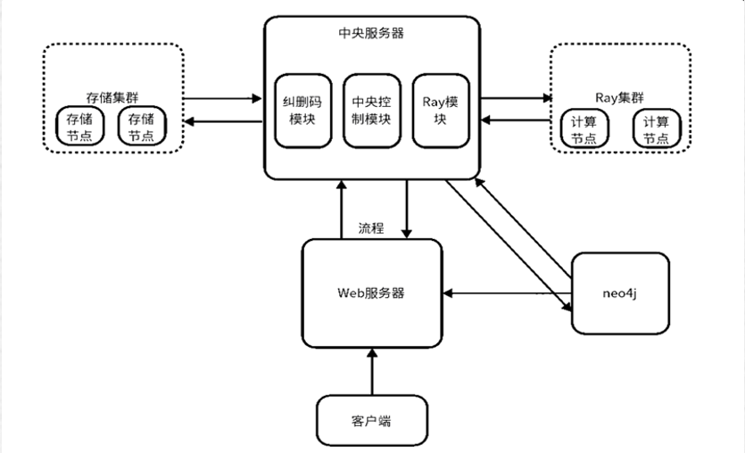
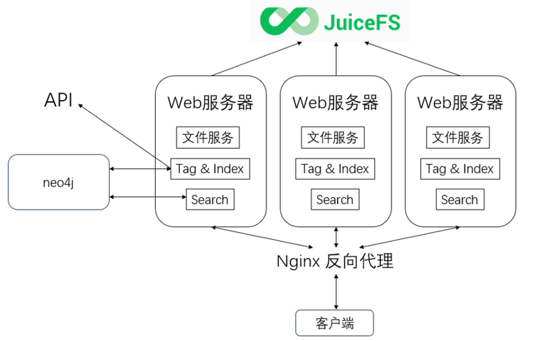
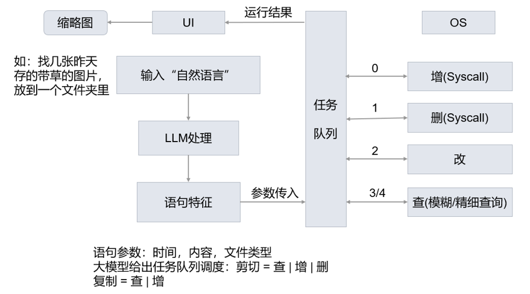
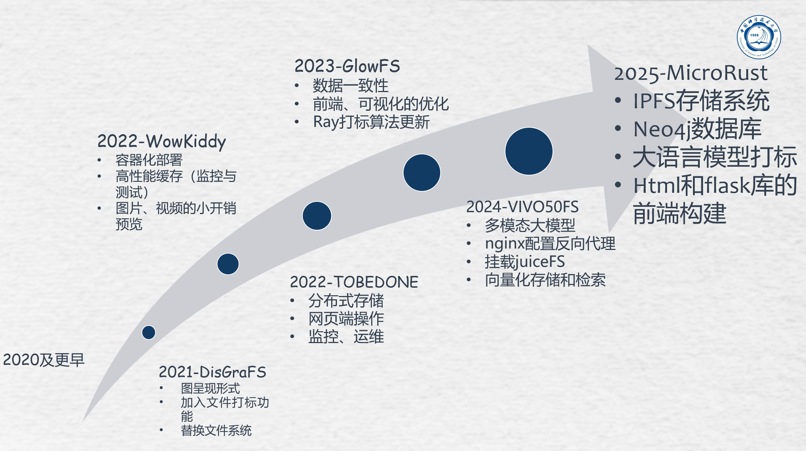

# 结题报告

## 目录

[结题报告](#结题报告)
- [结题报告](#结题报告)
  - [目录](#目录)
  - [项目介绍](#项目介绍)
  - [小组成员以及分工](#小组成员以及分工)
  - [立项依据](#立项依据)
    - [相关项目概述](#相关项目概述)
      - [MyGlow](#myglow)
        - [客户端](#客户端)
        - [web服务器](#web服务器)
        - [中央服务器](#中央服务器)
          - [纠删码模块](#纠删码模块)
          - [MySQL](#mysql)
          - [Ray模块](#ray模块)
        - [分布式存储集群](#分布式存储集群)
        - [分布式计算集群](#分布式计算集群)
        - [neo4j](#neo4j)
      - [VIVO50FS](#vivo50fs)
        - [客户端](#客户端-1)
        - [web服务器](#web服务器-1)
        - [JuiceFS](#juicefs)
        - [Nginx反向代理](#nginx反向代理)
        - [API](#api)
        - [neo4j](#neo4j-1)
      - [ARKFS](#arkfs)
        - [解析层](#解析层)
        - [管理层](#管理层)
        - [执行层](#执行层)
        - [应用层](#应用层)
    - [创新方向](#创新方向)
      - [IPFS驱动的全分布式存储架构设计与实现](#ipfs驱动的全分布式存储架构设计与实现)
      - [融合大语言模型的图标签生成与索引机制](#融合大语言模型的图标签生成与索引机制)
      - [自然语言接口支持的智能文件交互系统](#自然语言接口支持的智能文件交互系统)
  - [项目设计](#项目设计)
    - [系统架构](#系统架构)
    - [IPFS分布式存储模块](#ipfs分布式存储模块)
    - [Neo4j图数据库模块](#neo4j图数据库模块)
    - [大语言模型内容解析模块](#大语言模型内容解析模块)
    - [Web前端](#web前端)
  - [效果展示](#效果展示)
  - [最终项目与中期设计对比](#最终项目与中期设计对比)
  - [项目总结](#项目总结)
  - [致谢](#致谢)

## 项目介绍

本项目名为 `MicroRust`，是一个支持多种文件类型和搜索模式的的分布式图文件系统，本项目在24年项目VIVO50FS和ArkFS的基础上，构建了一个智能分布式图文件存储系统，并为用户提供了简洁直观的Web服务接口，支持文件的上传、检索与下载。系统由三大核心模块组成：基于IPFS实现的分布式存储模块，用于安全高效地保存文件；Neo4j图数据库模块，用于管理文件间的结构化关系；以及结合大语言模型的内容解析模块，负责对文件进行语义理解与标签生成。系统首先利用大语言模型对文件内容进行语义分析，提取关键词与标签，随后借助Neo4j构建文件间的关联网络，提升检索效率与信息组织能力，最后使用IPFS高效、安全地分布式储存文件。整体方案融合了大语言模型与图文件结构的优势，提供了一种面向大语言模型时代的智能分布式图文件系统服务的实现方案。

## 小组成员以及分工

- 叶梓文: IPFS模块，各个模块间的整合。
- 陈聆祎: Neo4j模块。
- 黄袁宇轩: 大语言模型模块。
- 刘雅兰: 协助完成大语言模块。
- 许傲施: 网页前端设计。
- 娄彦轩: 前期资料查找。

上述分工仅体现了每位小组成员在项目中的主要职责。在实际开发过程中，项目的各个方面都凝聚了每位成员的共同努力与协作，成果是团队协同配合的共同结晶。

## 立项依据
### 相关项目概述
#### MyGlow

MyGlow将2021年的x-DisGraFS图文件系统应用在分布式文件系统上，建立了一个支持Web服务分布式文件系统平台。该平台在实现云存储的前提下，兼具图文件系统方便用户快速搜索、模糊搜索、查找相关文件的特点。My-Glow项目搭建了整个分布式框架，解决了数据一致性问题，让整个图文件系统的鲁棒性大大提高，可以应对多种突发情况并且保证正确性；同时，项目重写了前端和可视化来实现具有更好体验的图文件系统；进一步，项目更新了ray打标的大模型，让图文件系统更加准确，提高了效率和体验。项目结构如上图，一共分为六个模块。

##### 客户端
访问web服务器接入，呈现给用户的界面，用户可以进行文件和文件夹操作，查看图的结构以及查找文件等等。客户端以网页的形式展现，可以直接使用浏览器访问，使用python和JavaScript编写，与一般网页编程无异。

##### web服务器
处理客户端的请求，同时和中央服务器交互。

##### 中央服务器
分布式系统的核心，负责调度，管理和协调整个系统的运行。中央服务器是MyGlow项目开发的重点,项目在中央服务器中实现了纠删码模块、MySQL和Ray模块。其中，纠删码模块可以增强数据的可靠性和存储效率，MySQL用于管理文件的图数据关系，Ray模块用于支持图文件系统的打标算法。

###### 纠删码模块
纠删码（Erasure Coding，EC）是一种数据冗余技术，广泛应用于分布式存储系统，能提供相似的数据恢复能力，同时显著减少存储开销，以提高数据的可靠性和存储效率。纠删码的基本思想是将数据块（Data Blocks）编码成多个数据分片（Data Shards）和校验分片（Parity Shards），并分布存储到不同的节点中，如果某些分片丢失或损坏，可以使用剩余的数据和校验分片恢复原始数据。

###### MySQL
MySQL是一种开源的关系型数据库管理系统，它使用结构化查询语言(SQL)进行数据库管理，因其高性能、可靠性强、易用等特点，被广泛应用于网站、应用程序、企业系统等领域。在图文件系统中，MySQL可以和图数据库混合使用：MySQL存储元数据，图数据库存储关系数据。

###### Ray模块
Ray是一个用于构建分布式应用程序的开源框架。它旨在使开发人员能够轻松地编写高性能，可扩展的分布式应用程序，尤其是处理大规模数据和机器学习任务。

##### 分布式存储集群
文件切片后的存储位置。

##### 分布式计算集群
Ray模块实现的计算集群。

##### neo4j
Neo4j是一个高性能的NOSQL图形数据库，用于存储图文件系统的文件关系。它将结构化数据存储在图上而不是表中；它是一个嵌入式的，基于磁盘的，具备完全的事务特性的Java持久化高性能引擎，该引擎具有成熟数据库的所有特性；它是一个可扩展，符合ACID的图形数据库，采用了高性能分布式集群架构设计，并可用于自托管和云产品；其查询语言为cypher，编写语言为java。

#### VIVO50FS

VIVO50FS在MyGlow项目的基础上，主要针对图文件系统中多模态数据的处理和中央服务器的负载均衡问题。项目首先尝试使用多模态大模型来生成向量化索引；同时，项目尝试利用反向代理优化中央服务器，从而使得该图文件系统可以更好地支持不同格式的文件，并拥有更好的性能；最后，项目在优化往年架构的同时，将本地存储优化为在JuiceFS中存储，还加入了多种检索文件的方式，使得对文件的检索更加准确。项目结构如上图，一共分为六个模块。

##### 客户端
同MyGlow的客户端。

##### web服务器
相当于MyGlow的中央服务器和web服务器的合并，每个web服务器都包含了MyGlow的纠删码模块、MySQL和Ray模。同时，项目加入了多个web服务器用来进行负载均衡。

##### JuiceFS
JuiceFS是一种面向云计算的分布式文件系统，专门为大规模数据存储和大数据分析场景设计。它将元数据存储在数据库中（如MySQL），而将文件数据存储在对象存储或分布式存储上，采用存算分离架构，通过元数据与数据分离存储来实现高性能、低成本的文件存储解决方案。其核心实现原理包括元数据管理、数据存储、缓存机制、并发控制和一致性保证。JuiceFS提供了丰富的API，适用于各种形式数据的管理、分析、归档、备份，可以在不修改代码的前提下无缝对接大数据、机器学习、人工智能等应用平台，为其提供海量、弹性、低价的高性能存储。

##### Nginx反向代理
Nginx是异步框架的网页服务器，可以用作反向代理、负载平衡器和HTTP缓存。Nginx将项目的多个web服务器通过方向代理和负载平衡整合，以一个虚拟“服务器”的形式与客户端互动。

##### API
大模型打标的接口，vivo50项目利用llamaindex（将大语言模型和外部数据连接在一起的工具）进行打标。我们的项目将使用ARKFS项目的AIOS进行打标，可能需要对该接口进行一定的修改。

##### neo4j
同MyGlow的neo4j。

#### ARKFS

ARKFS项目受AIOS（即大语言模型智能体操作系统）思想启发，旨在利用大语言模型提取文本中的关键信息，形成特征向量传递给任务调度层，通过执行对应操作，实现文件系统的自动化操作，以提高文件系统操作的自动化程度和效率，减少人工干预，提升用户体验。项目结构如上图，主要分为解析层、管理层、执行层和应用层四个部分。

##### 解析层
解析层负责对自然语言命令的解析。

##### 管理层
管理层负责任务队列的建立。

##### 执行层
执行层负责增、删、改、查等操作。

##### 应用层
应用层负责用户交互界面的设计，实现用户输入、调用流程、展示与筛选等功能。

### 创新方向
本项目在继承和整合已有系统设计成果的基础上，提出并实现了一套面向大语言模型时代的智能分布式图文件系统服务。我们借鉴了MyGLow项目在图结构化文件存储方面的初步设计思路，并分析了VIVO50FS项目在分布式中央服务器架构与向量化索引应用中存在的局限性，如对中心服务器的强依赖性、系统可靠性与可扩展性不足、以及文件搜索结果缺乏可解释性等问题。在此基础上，项目吸收了ARKFS项目中关于自然语言输入处理与大模型标注机制的关键技术成果，结合当下人工智能与去中心化技术的最新发展，提出并实现了更具智能性与用户友好性的分布式图文件系统。

具体而言，我们在系统架构层面引入了IPFS的P2P协议，以取代传统中心化服务器结构。IPFS 通过内容寻址与去中心化网络传播机制，有效提升了系统的数据冗余性与容错能力，同时优化了文件的分发与访问速度，为构建高度可扩展、高可靠性的数据存储平台提供了技术支撑。这一架构转变标志着我们项目从“中心服务器+云存储”向“原生分布式+边缘协同”范式的转型，符合当前分布式存储领域的发展趋势。

在智能化索引与交互方面，我们融合了大语言模型LLM的语义理解与生成能力，构建了基于自然语言处理的文件关系标注机制，并将标签结果组织为图结构索引。相比于传统向量化检索方式，本系统不仅保持了高效的数据检索能力，还大幅增强了用户对文件关系的可视化与可解释性体验。用户可通过自然语言描述其需求，由大模型对文件进行语义解析与上下文推理，返回结构化的文件路径与关系图谱，从而实现类人化的智能文件导航。这一机制显著提升了系统的人机交互友好性，拓展了AI能力在数据管理领域的实际应用深度。

综上所述，本项目在系统架构、索引机制与人机交互三个关键层面实现了多项创新：（1）构建了基于IPFS的原生分布式图文件系统架构；（2）引入大语言模型辅助的图结构标签索引机制；（3）实现了基于自然语言的高可解释性文件检索与操作服务。这些创新不仅有效回应了现有系统的瓶颈问题，也为未来分布式智能存储系统的设计提供了有益参考。

#### IPFS驱动的全分布式存储架构设计与实现

#### 融合大语言模型的图标签生成与索引机制

#### 自然语言接口支持的智能文件交互系统

## 项目设计
### 系统架构
### IPFS分布式存储模块
### Neo4j图数据库模块
### 大语言模型内容解析模块
### Web前端

## 效果展示

## 最终项目与中期设计对比

## 项目总结

本项目是在过去几年内几个OSH项目基础上优化发展而来的。

## 致谢

感谢刑凯老师参与了本小组选题、可行性、各个阶段的讨论并提出意见和启发性建议，帮助我们确定了项目的方向。

感谢本次担任助教的学长的帮助。
