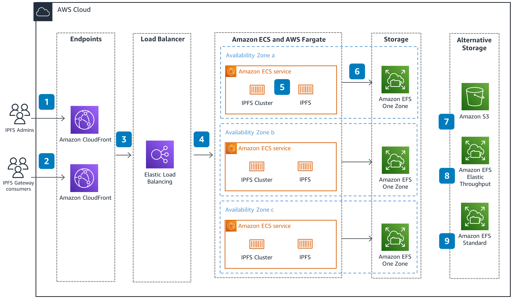
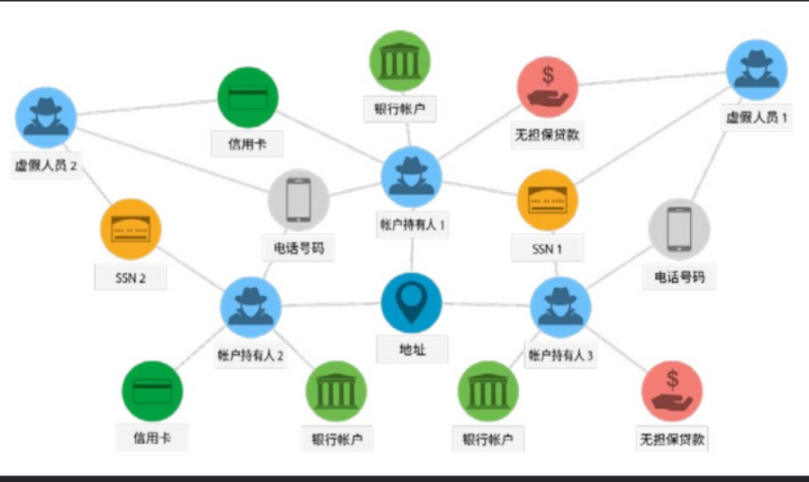

# 结题报告
## 目录

[结题报告](#结题报告)
- [结题报告](#结题报告)
  - [目录](#目录)
  - [项目介绍](#项目介绍)
  - [小组成员以及分工](#小组成员以及分工)
  - [立项依据](#立项依据)
    - [相关项目概述](#相关项目概述)
      - [MyGlow](#myglow)
        - [客户端](#客户端)
        - [web服务器](#web服务器)
        - [中央服务器](#中央服务器)
          - [纠删码模块](#纠删码模块)
          - [MySQL](#mysql)
          - [Ray模块](#ray模块)
        - [分布式存储集群](#分布式存储集群)
        - [分布式计算集群](#分布式计算集群)
        - [neo4j](#neo4j)
      - [VIVO50FS](#vivo50fs)
        - [客户端](#客户端-1)
        - [web服务器](#web服务器-1)
        - [JuiceFS](#juicefs)
        - [Nginx反向代理](#nginx反向代理)
        - [API](#api)
        - [neo4j](#neo4j-1)
      - [ARKFS](#arkfs)
        - [解析层](#解析层)
        - [管理层](#管理层)
        - [执行层](#执行层)
        - [应用层](#应用层)
    - [创新方向](#创新方向)
      - [IPFS驱动的全分布式存储架构设计与实现](#ipfs驱动的全分布式存储架构设计与实现)
        - [IPFS概述](#ipfs概述)
        - [IPFS关键结构](#ipfs关键结构)
        - [IPFS核心原理](#ipfs核心原理)
        - [IPFS一致性分析](#ipfs一致性分析)
        - [IPFS核心优势](#ipfs核心优势)
        - [IPFS与JuiceFS的比较](#ipfs与juicefs的比较)
      - [融合大语言模型图标签生成的Neo4j索引机制](#融合大语言模型图标签生成的neo4j索引机制)
        - [图数据库和Neo4j](#图数据库和neo4j)
          - [图数据库](#图数据库)
          - [关键概念](#关键概念)
          - [Neo4j](#neo4j-2)
      - [基于多模态api和采用图文件系统的优势](#基于多模态api和采用图文件系统的优势)
  - [项目设计](#项目设计)
    - [系统架构](#系统架构)
    - [IPFS分布式存储模块](#ipfs分布式存储模块)
      - [IPFS服务下载](#ipfs服务下载)
      - [IPFS节点初始化](#ipfs节点初始化)
      - [IPFS节点连接](#ipfs节点连接)
      - [IPFS基础操作](#ipfs基础操作)
      - [IPFS功能扩展](#ipfs功能扩展)
    - [Neo4j图数据库模块](#neo4j图数据库模块)
      - [Neo4j的部署](#neo4j的部署)
      - [Neo4j的使用](#neo4j的使用)
      - [Neo4j与IPFS的协作](#neo4j与ipfs的协作)
      - [模糊匹配和功能扩展](#模糊匹配和功能扩展)
      - [Neo4j功能扩展](#neo4j功能扩展)
    - [大语言模型内容解析模块](#大语言模型内容解析模块)
      - [功能介绍](#功能介绍)
      - [大模型部署的选择和优缺点分析](#大模型部署的选择和优缺点分析)
      - [大模型的本地部署](#大模型的本地部署)
      - [大模型api选取](#大模型api选取)
      - [文件tag生成方案](#文件tag生成方案)
      - [处理用户命令问题的优化](#处理用户命令问题的优化)
    - [Web前端](#web前端)
      - [前端的不同实现方式和优缺点分析](#前端的不同实现方式和优缺点分析)
      - [前端优化方向](#前端优化方向)
  - [效果展示](#效果展示)
    - [文件上传](#文件上传)
    - [文件搜索](#文件搜索)
    - [文件下载、删除和预览](#文件下载删除和预览)
  - [最终项目与前期设计对比](#最终项目与前期设计对比)
    - [调研阶段](#调研阶段)
    - [可行性分析阶段](#可行性分析阶段)
    - [中期汇报阶段](#中期汇报阶段)
    - [最终项目](#最终项目)
  - [项目总结](#项目总结)
  - [致谢](#致谢)

## 项目介绍

本项目名为 `MicroRust`，是一个支持多种文件类型和搜索模式的的分布式图文件系统，本项目在24年项目VIVO50FS和ArkFS的基础上，构建了一个智能分布式图文件存储系统，并为用户提供了简洁直观的Web服务接口，支持文件的上传、检索与下载。系统由三大核心模块组成：基于IPFS实现的分布式存储模块，用于安全高效地保存文件；Neo4j图数据库模块，用于管理文件间的结构化关系；以及结合大语言模型的内容解析模块，负责对文件进行语义理解与标签生成。系统首先利用大语言模型对文件内容进行语义分析，提取关键词与标签，随后借助Neo4j构建文件间的关联网络，提升检索效率与信息组织能力，最后使用IPFS高效、安全地分布式储存文件。整体方案融合了大语言模型与图文件结构的优势，提供了一种面向大语言模型时代的智能分布式图文件系统服务的实现方案。

## 小组成员以及分工

- 叶梓文: IPFS模块，各个模块间的整合。
- 陈聆祎: Neo4j模块。
- 黄袁宇轩: 大语言模型模块,lab4。
- 刘雅兰: 协助完成大语言模块,lab4。
- 许傲施: 网页前端设计。
- 娄彦轩: 前期资料查找。

上述分工仅体现了每位小组成员在项目中的主要职责。在实际开发过程中，项目的各个方面都凝聚了每位成员的共同努力与协作，成果是团队协同配合的共同结晶。

## 立项依据

### 相关项目概述
#### MyGlow


MyGlow将2021年的x-DisGraFS图文件系统应用在分布式文件系统上，建立了一个支持Web服务分布式文件系统平台。该平台在实现云存储的前提下，兼具图文件系统方便用户快速搜索、模糊搜索、查找相关文件的特点。My-Glow项目搭建了整个分布式框架，解决了数据一致性问题，让整个图文件系统的鲁棒性大大提高，可以应对多种突发情况并且保证正确性；同时，项目重写了前端和可视化来实现具有更好体验的图文件系统；进一步，项目更新了ray打标的大模型，让图文件系统更加准确，提高了效率和体验。项目结构如上图，一共分为六个模块。

##### 客户端

访问web服务器接入，呈现给用户的界面，用户可以进行文件和文件夹操作，查看图的结构以及查找文件等等。客户端以网页的形式展现，可以直接使用浏览器访问，使用python和JavaScript编写，与一般网页编程无异。

##### web服务器

处理客户端的请求，同时和中央服务器交互。

##### 中央服务器

分布式系统的核心，负责调度，管理和协调整个系统的运行。中央服务器是MyGlow项目开发的重点,项目在中央服务器中实现了纠删码模块、MySQL和Ray模块。其中，纠删码模块可以增强数据的可靠性和存储效率，MySQL用于管理文件的图数据关系，Ray模块用于支持图文件系统的打标算法。

###### 纠删码模块

纠删码（Erasure Coding，EC）是一种数据冗余技术，广泛应用于分布式存储系统，能提供相似的数据恢复能力，同时显著减少存储开销，以提高数据的可靠性和存储效率。纠删码的基本思想是将数据块（Data Blocks）编码成多个数据分片（Data Shards）和校验分片（Parity Shards），并分布存储到不同的节点中，如果某些分片丢失或损坏，可以使用剩余的数据和校验分片恢复原始数据。

###### MySQL

MySQL是一种开源的关系型数据库管理系统，它使用结构化查询语言(SQL)进行数据库管理，因其高性能、可靠性强、易用等特点，被广泛应用于网站、应用程序、企业系统等领域。在图文件系统中，MySQL可以和图数据库混合使用：MySQL存储元数据，图数据库存储关系数据。

###### Ray模块

Ray是一个用于构建分布式应用程序的开源框架。它旨在使开发人员能够轻松地编写高性能，可扩展的分布式应用程序，尤其是处理大规模数据和机器学习任务。

##### 分布式存储集群

文件切片后的存储位置。

##### 分布式计算集群

Ray模块实现的计算集群。

##### neo4j

Neo4j是一个高性能的NOSQL图形数据库，用于存储图文件系统的文件关系。它将结构化数据存储在图上而不是表中；它是一个嵌入式的，基于磁盘的，具备完全的事务特性的Java持久化高性能引擎，该引擎具有成熟数据库的所有特性；它是一个可扩展，符合ACID的图形数据库，采用了高性能分布式集群架构设计，并可用于自托管和云产品；其查询语言为cypher，编写语言为java。

#### VIVO50FS


VIVO50FS在MyGlow项目的基础上，主要针对图文件系统中多模态数据的处理和中央服务器的负载均衡问题。项目首先尝试使用多模态大模型来生成向量化索引；同时，项目尝试利用反向代理优化中央服务器，从而使得该图文件系统可以更好地支持不同格式的文件，并拥有更好的性能；最后，项目在优化往年架构的同时，将本地存储优化为在JuiceFS中存储，还加入了多种检索文件的方式，使得对文件的检索更加准确。项目结构如上图，一共分为六个模块。

##### 客户端

同MyGlow的客户端。

##### web服务器

相当于MyGlow的中央服务器和web服务器的合并，每个web服务器都包含了MyGlow的纠删码模块、MySQL和Ray模。同时，项目加入了多个web服务器用来进行负载均衡。

##### JuiceFS

JuiceFS是一种面向云计算的分布式文件系统，专门为大规模数据存储和大数据分析场景设计。它将元数据存储在数据库中（如MySQL），而将文件数据存储在对象存储或分布式存储上，采用存算分离架构，通过元数据与数据分离存储来实现高性能、低成本的文件存储解决方案。其核心实现原理包括元数据管理、数据存储、缓存机制、并发控制和一致性保证。JuiceFS提供了丰富的API，适用于各种形式数据的管理、分析、归档、备份，可以在不修改代码的前提下无缝对接大数据、机器学习、人工智能等应用平台，为其提供海量、弹性、低价的高性能存储。

##### Nginx反向代理

Nginx是异步框架的网页服务器，可以用作反向代理、负载平衡器和HTTP缓存。Nginx将项目的多个web服务器通过方向代理和负载平衡整合，以一个虚拟“服务器”的形式与客户端互动。

##### API

大模型打标的接口，vivo50项目利用llamaindex（将大语言模型和外部数据连接在一起的工具）进行打标。我们的项目将使用ARKFS项目的AIOS进行打标，可能需要对该接口进行一定的修改。

##### neo4j

同MyGlow的neo4j。

#### ARKFS


ARKFS项目受AIOS（即大语言模型智能体操作系统）思想启发，旨在利用大语言模型提取文本中的关键信息，形成特征向量传递给任务调度层，通过执行对应操作，实现文件系统的自动化操作，以提高文件系统操作的自动化程度和效率，减少人工干预，提升用户体验。项目结构如上图，主要分为解析层、管理层、执行层和应用层四个部分。

##### 解析层

解析层负责对自然语言命令的解析。

##### 管理层

管理层负责任务队列的建立。

##### 执行层

执行层负责增、删、改、查等操作。

##### 应用层

应用层负责用户交互界面的设计，实现用户输入、调用流程、展示与筛选等功能。

### 创新方向

本项目在继承和整合已有系统设计成果的基础上，提出并实现了一套面向大语言模型时代的智能分布式图文件系统服务。我们借鉴了MyGLow项目在图结构化文件存储方面的初步设计思路，并分析了VIVO50FS项目在分布式中央服务器架构与向量化索引应用中存在的局限性，如对中心服务器的强依赖性、系统可靠性与可扩展性不足、以及文件搜索结果缺乏可解释性等问题。在此基础上，项目吸收了ARKFS项目中关于自然语言输入处理与大模型标注机制的关键技术成果，结合当下人工智能与去中心化技术的最新发展，提出并实现了更具智能性与用户友好性的分布式图文件系统。

具体而言，我们在系统架构层面引入了IPFS的P2P协议，以取代传统中心化服务器结构。IPFS通过内容寻址与去中心化网络传播机制，有效提升了系统的数据冗余性与容错能力，同时优化了文件的分发与访问速度，为构建高度可扩展、高可靠性的数据存储平台提供了技术支撑。这一架构转变标志着我们项目从“中心服务器+云存储”向“原生分布式+边缘协同”范式的转型，符合当前分布式存储领域的发展趋势。

在智能化索引与交互方面，我们融合了大语言模型LLM的语义理解与生成能力，构建了基于自然语言处理的文件关系标注机制，并将标签结果组织为图结构索引。我们选择将融入知识图谱的应用，相比于传统向量化检索方式，本系统不仅保持了高效的数据检索能力，保证了检索的绝对准确性，还大幅增强了用户对文件关系的可视化与可解释性体验。这也是我们将表示学习与大模型结合的一次尝试，用户可通过自然语言描述其需求，由大模型对文件进行语义解析与上下文推理，返回结构化的文件路径与关系图谱，从而实现类人化的智能文件导航。这一机制显著提升了系统的人机交互友好性，拓展了AI能力在数据管理领域的实际应用深度。

在大模型选取方面，我们仍然进行了本地部署与远程api使用的部署测试与对比，我们在对比了效率与成本以后，仍然选择了api远程获得相应信息，我们选择了不同的大模型进行了不同的尝试，例如：deepseek、星火、通义千问、AzureOpenAI、Mistral，同时我们的项目支持大模型的修改、支持多模态的使用。

综上所述，本项目在系统架构、索引机制与人机交互三个关键层面实现了多项创新：（1）构建了基于IPFS的原生分布式图文件系统架构；（2）引入大语言模型辅助的图结构标签索引机制；（3）实现了基于自然语言的高可解释性文件检索与操作服务。这些创新不仅有效回应了现有系统的瓶颈问题，也为未来分布式智能存储系统的设计提供了有益参考。

#### IPFS驱动的全分布式存储架构设计与实现
##### IPFS概述

IPFS是InterPlanetary File System的缩写。它是一个分布式的网络传输协议，可以把文件分成很多小块放到服务器的不同地方，然后用一种特别的方式来寻找和传输这些小块。这样，我们就可以更快、更安全、更抗容错地存储文件了。


##### IPFS关键结构

- **分布式哈希表（DHT）**：IPFS使用分布式哈希表来实现内容寻址。每个文件都由其内容的哈希值唯一标识（CID）。DHT 允许节点根据内容的哈希值快速定位文件，而不需要中心化的服务器。
- **内容寻址**：IPFS使用内容寻址来定位文件，而不是基于位置的寻址。这意味着文件的位置由其内容决定，而不是存储它的物理位置。只要文件内容不变，其地址就保持一致。
- **点对点通信**：IPFS节点通过点对点通信协议相互连接。节点可以请求文件、发布文件、转发请求等。这种点对点通信模型有助于提高网络的可扩展性和抗攻击性。
- **内容缓存**：IPFS节点可以缓存他们访问过的文件内容，以便在将来请求时更快地提供文件。这种缓存机制有助于减少重复传输和提高网络性能。
- **数据块**：IPFS 将文件分割为数据块，并使用Merkle DAG（有向无环图）来组织这些数据块。文件被分割成多个小块，每个块都有一个唯一的哈希值。这些块通过有向无环图结构连接起来，形成一个树状结构。这种结构不仅便于数据的快速检索和验证，还支持高效的版本控制和增量更新。例如，当文件发生局部修改时，只需要更新修改部分的块及其相关的哈希值，而无需重新计算整个文件的哈希。
- **内容生产者和消费者**：IPFS允许任何节点成为内容的生产者和消费者。节点可以发布自己的内容，并为其他节点提供访问。同时，节点也可以请求并检索其他节点发布的内容。

##### IPFS核心原理

- **内容寻址**：传统的云储存服务采用的是基于位置的文件寻址，即通过URL指向服务器上的存储的某个特定文件；而在IPFS中，文件的寻址方式转变为内容寻址，即文件的地址是该内容的加密哈希值。
- **数据分块**：IPFS不直接存储整个文件，而是采用数据分块机制，将文件拆分为多个固定大小（通常为 256KB）的数据块，每个块也拥有自己的哈希值作为标识。文件数据块通常以有向无环图（DAG）的形式组织；每个文件对应一个根节点，该节点记录文件的结构以及所有子块的哈希引用，从而形成一个可验证的树状结构，便于高效的数据校验与分布式存储。

##### IPFS一致性分析

IPFS采用内容寻址和数据分块以实现分布式点对点网络结构，其不以强一致性为目标，而是设计为最终一致性系统。
- **强一致性**：强一致性是一种严格的一致性保证，指的是系统中的所有操作都能够保证在同一时间点内，对所有客户端的视图是一致的；换句话说，一旦数据被更新，无论在哪个节点访问，都会看到最新的版本。
- **最终一致性系统**：最终一致性是弱一致性的一种特殊情况，指的是在没有进一步的操作或更新后，所有副本的数据最终会达到一致的状态；它并不要求所有操作在执行时都能立即在所有副本中同步，而是允许系统中的不同副本在一段时间内存在不一致的状态，但经过一定时间，所有副本最终会达到一致。以IPFS文件系统为例，当用户仅从本地节点访问文件时，如果其他节点上传的新文件内容尚未同步到该节点，用户将无法获取到相应的文件；然而，当本地节点与其他节点进行通信并请求相应的数据时，本地节点便可以从其他节点检索到新上传的内容，并将其同步到本地缓存中；此时，用户便能访问到最新上传的文件内容。

IPFS通过其去中心化的架构实现了最终一致性，即在网络中的不同节点间，文件内容在经过一段时间后将最终达到一致。IPFS采用内容寻址和数据分块，每个文件通过其内容生成唯一的CID，确保文件的不可篡改性和一致性。当文件上传到网络时，它被分割为多个数据块，并将这些数据块存储在多个节点上，通过有向无环图结构组织，确保文件数据的完整性和可靠性。为了实现最终一致性，IPFS通过DHT进行节点之间的内容查找和同步，当一个节点需要访问某个文件时，它会通过DHT从其他节点请求文件的各个数据块，经过异步的方式同步数据；这一过程确保了即使在网络中某些节点未及时同步文件内容，随着时间的推移，所有相关节点最终能够获取到完整一致的文件数据。尽管存在网络延迟和节点离线的情况，IPFS的去中心化存储和异步同步机制保证了系统的高可用性和容错性，使得系统能够在短时间内恢复一致性。


##### IPFS核心优势

1. **稳定性**
   - 采用内容寻址（CID）替代路径寻址，确保文件的唯一性和不可篡改性。
   - 通过文件分片和多节点存储，单节点故障不影响整体可用性，增强了系统的稳定性。
2. **可靠性**
   - IPFS 是完全去中心化的，不依赖任何云存储服务，更利于长期数据保留与迁移。
3. **节点协同**
   - 从最近的节点获取数据，降低延迟（如BitTorrent协议）。
   - 将文件内容分散在IPFS网络中的所有存储节点，极大地将其单个节点的存储成本。
   - 数据可通过多个节点分发下载，适合跨地域大规模共享。

##### IPFS与JuiceFS的比较

相比于JuiceFS，IPFS通过实现最终一致性而非强一致性，在多个方面展现了其独特的优势，特别是在去中心化、抗审查和高容错的需求上。


1. 去中心化 是IPFS最显著的特点之一。与JuiceFS这种依赖中心化元数据服务的文件系统不同，IPFS不依赖于任何单一服务器或集中的存储节点，而是通过DHT和P2P网络实现文件的存储和检索。这意味着文件存储不受单点故障的影响，系统能够在没有任何中央管理的情况下运行，这对于抗审查和提高系统可用性至关重要。而JuiceFS作为一个基于云服务的分布式文件系统，虽然在性能和一致性方面表现突出，但依赖于中心化的存储和元数据服务，可能面临一些集中式系统的安全与可用性风险。
2. 抗审查性能是IPFS的另一个优势。由于IPFS的去中心化结构，任何用户都可以上传文件，且文件存储在多个节点上。即使某些节点或国家对内容进行封锁或审查，用户仍然能够通过其他节点访问文件。这种分散式的存储与访问方式，使得IPFS在面对政府审查或服务中断时具有更强的抗干扰能力。相比之下，JuiceFS作为一个依赖于云原生架构的文件系统，虽然能够提供强一致性和高性能的文件共享，但其依赖于中央化的存储服务，一旦中央服务器出现意外，所用用户文件的存储都会收到影响。
3. IPFS通过最终一致性的模型提供了更高的容错性。在分布式系统中，由于节点的离线或网络延迟，数据的一致性可能无法实时保证。IPFS的设计通过容忍短时间的“不一致”来提高系统的容错能力，只要系统进行异步同步，最终所有节点的数据将会一致。这意味着，即使某些节点暂时无法访问或获取最新的数据，随着时间的推移，所有副本最终都会同步和一致。这种容忍网络延迟和节点不可用的方式，能够保证系统的高可用性。而JuiceFS由于实现了强一致性，即每个写操作都需要同步到所有节点，尽管保证了数据的实时一致性，但也带来了更高的性能开销和对系统可用性的潜在影响，尤其在节点故障或网络分区的情况下，可能会影响到系统的持续可用性。
4. 从可扩展性的角度来看，IPFS 通过内容寻址与数据分块，能够以更低的成本进行大规模的数据分发和存储。由于IPFS的每个节点只需要存储与自己相关的文件块，并通过哈希值查找其他文件，文件系统的扩展性较好，能够应对大规模数据的分布式存储。而JuiceFS则更多依赖于集中的云服务和元数据管理，虽然可以提供强一致性保障，但在面对极大的数据量和高并发请求时，可能会面临性能瓶颈或扩展困难。

#### 融合大语言模型图标签生成的Neo4j索引机制
##### 图数据库和Neo4j
###### 图数据库

图数据库（Graph Database，GDB）是一种用于存储和处理图形数据的数据库，该系统的一个关键概念是图，它将数据建模为图结构，将存储中的数据项与数据节点以及节点间表示关系的边的集合进行关联，从而使用节点之间以边相连的图结构进行数据的表示。这些关系使得数据库中的数据直接链接在一起，易于检索。图数据库专为处理复杂关系和连接数据而设计，适用于存储和查询高度互联的数据，与传统的关系型数据库相比，图的文件关联形式与人类的思考模式类似，在处理涉及多个关系的数据时，更具用户友好性。

###### 关键概念

- **节点**：构成一张图的基本元素是节点和关系，节点和关系都可以附带属性。
- **关系**：通过关系可以找到很多关联的数据，比如节点集合，关系集合以及他们的属性集合。
- **属性**：节点和关系都可以设置自己的属性。 属性是由Key-Value键值对组成，键名是字符串。
- **路径**：路径由至少一个节点，通过各种关系连接组成，经常是作为一个查询或者遍历的结果。
- **遍历**：遍历一张图就是按照一定的规则，跟随他们的关系，访问关联的的节点集合。

###### Neo4j

Neo4j是一个高性能的NOSQL图形数据库，它将结构化数据存储在图上而不是表中。它是一个采用了高性能分布式集群架构设计的Java持久化高性能引擎，通过该引擎实现了一个可扩展、符合ACID的图形数据库，并可用于自托管和云产品。项目Neo4j查询语言为cypher，编写语言为java。


#### 基于多模态api和采用图文件系统的优势
1. **图数据库引入**：集成大语言模型api，生成标签的同时建立逻辑图谱关系，替换传统文本内容匹配操作。
2. **跨模态索引**：支持对文本、图像等多模态数据进行先打标再对标签建立逻辑关系，从而实现跨模态检索。
3. **自然语言标签**：通过自然语言分析生成用户可以理解的文件标签，帮助用户直观快速地理解文件直接的关系。

## 项目设计
### 系统架构


本项目整体架构由三个核心功能模块——IPFS模块、Neo4j模块、大语言模型模块，以及一个配套的Web应用组成，其接口交互与整体架构如上图所示。用户通过Web应用与系统进行交互，可执行文件的上传、下载及预览操作。Web应用在接收到用户指令后，会首先调用大语言模型模块对自然语言命令进行解析，并自动生成用于检索的语义标签；随后，通过Neo4j模块根据这些标签在图数据库中查询与之相关联的CID；最后，由IPFS模块根据查询到的CID执行具体的文件上传或下载操作，实现内容的分布式管理与访问。

接下来，我们将分别介绍项目中各个核心模块的设计与实现。

### IPFS分布式存储模块
#### IPFS服务下载

IPFS服务依赖于本地的IPFS可执行文件，在使用我们的Web服务之前，需要在本地部署IPFS服务。
为了简化部署工作，我们将其封装为了一个install程序，适配Windows和Linux平台，安装完成后可直接使用ipfs命令。
- 平台识别与安装包地址生成
- 自动下载IPFS安装包并解压文件
- 自动安装 PFS可执行文件
- 执行ipfs init初始化IPFS节点
- 清理临时文件

#### IPFS节点初始化

为了使用IPFS节点支持Web应用，需要使用ipfs命令完成对IPFS节点的初始化，我们将其封装为start_ipfs和connect_ipfs函数。
- start_ipfs： 初始化IPFS仓库并启动IPFS节点。
- connect_ipfs：获取IPFS节点的multiaddress。

在用户结束Web应用时，需要使用ipfs命令关闭IPFS节点，我们同样将其封装为terminate_ipfs函数。
- terminate_ipfs：关闭IPFS节点。

我们将上述函数整合进入了Web应用的启动和关闭过程，用户只需与Web应用交互。
  
#### IPFS节点连接

IPFS节点在本地启动后，需要通过建立分布式文件系统，我们需要连接不同系统上的IPFS节点。

为了最大程度上减少节点连接所需的时间，我们采用星型拓扑结构连接所有分布式系统的IPFS节点。
- 选定任一系统的IPFS节点作为中枢节点，记录该节点所在系统的ip地址，并告知其它所有分布式系统。
- 首先启动中枢节点的IPFS节点，获取节点的multiaddress。
- 随后启动其他IPFS节点并记录multiaddress，使用http协议与中枢节点交换彼此的multiaddress，通过IPFS接口互相连接。
- 节点之间不直接连接，只通过中枢节点进行消息转发。


这种星型拓扑结构虽然高度依赖于IPFS中枢节点的稳定性，但是极大地减少了IPFS节点加入分布式网络时需要进行的连接操作；在现实应用中，我们可以将提供Web服务的服务器作为IPFS中枢节点，既能提高IPFS节点接入网络的速度，又能利用服务器的可靠性确保分布式网络的稳定。
在测试时，我们采用了多台虚拟机模拟分布式系统：我们将主机的IPFS节点设置为中枢节点，将虚拟机的IPFS节点与主机的IPFS节点相连。


#### IPFS基础操作

- upload_file_to_ipfs：上传文件到IPFS并返回CID
- download_file_from_ipfs：从IPFS检测文件是否存在并返回下载地址
- get_file_content_from_ipfs：从IPFS获取文本文件内容

我们通过本地IPFS节点的http接口实现上述文件管理的基础操作。
```python
# upload_file_to_ipfs
response = requests.post(f"{IPFS_API_URL}/api/v0/add", params={"pin": "true"}, files = {"file": f}, timeout = TIME_OUT)

# download_file_from_ipfs
download_url = f"{IPFS_GATEWAY_URL}/ipfs/{cid}"
response = requests.get(download_url, timeout = TIME_OUT)

# get_file_content_from_ipfs
response = requests.post(f"{IPFS_API_URL}/api/v0/cat?arg={cid}", timeout = TIME_OUT)
```

#### IPFS功能扩展

1. 动态地选择IPFS节点的连接网络中的动态节点，例如，每次选择最先启动的IPFS节点作为中枢节点。
2. 改进IPFS节点网络的拓扑结构，以支持在部分IPFS节点异常失效时保持网络的完整性，例如，将星型拓扑改进为Fat-Tree结构，如下图所示。


### Neo4j图数据库模块
#### Neo4j的部署

我们使用云服务器部署了Neo4j数据库的云端服务，并通过python API支持客户端发送增加，删除和查询文件信息的请求，同时使用neo4j browser可以实时监控图数据库的使用情况和文件信息。

#### Neo4j的使用

在我们的项目中，Neo4j需要存储的文件和标签的基本信息，以及彼此之间关联信息。我们延用了VIVO50小组的设计，以文件和标签为点，以关联关系为边构建图文件系统。
在IPFS分布式协议中，每个文件上传时会同时生成一个IPFS的识别编码CID用于文件管理，因此我们将文件的文件名和CID作为关键信息放置在Neo4j的文件节点中；将


#### Neo4j与IPFS的协作

在我们的项目中图数据库与 IPFS 协议具有高度协同的作用。

1. 在用户上传文件时，先由 IPFS 系统生成 CID，再将文件信息添加至图文件系统。
2. 在用户下载或预览文件时，通过图文件系统查询到指定的文件，获取 CID 后再去向 IPFS 系统查询。
3. 在用户删除文件时，直接通过Neo4j删除对应节点即可。

#### 模糊匹配和功能扩展

在实际应用中，用户通常会给出多个标签，查询符合条件的文件，这些标签很可能不完整，也可能有错误的标签。在这种情况下，我们使用模糊匹配进行处理。在匹配所有标签失败时，我们考虑每个至少匹配一个标签的文件，将这些文件按照匹配标签的数量从大到小排序，然后保留匹配数量最大的3或5个文件，发送给前端让用户选择具体操作哪个文件。

#### Neo4j功能扩展
1. 可以在tag的基础上进行简单的虚拟文件夹设计，从而实现更高效的存储。
2. 我们的图文件系统使用的是最基础的模式匹配，可以为不同节点标签设置匹配度权值，从而计算相似度，再设置相应的阈值选取。
  
### 大语言模型内容解析模块
#### 功能介绍

引入大模型根据输入文件内容生成对应tag，可接受图片和文本文件的文件类型。

#### 大模型部署的选择和优缺点分析

1. 大模型部署在本地：采用大模型本地部署显卡资源要求高，但是在资源充足时速度快且稳定，安全性强，如果在大型项目资金充足时建议使用。
2. 远程api链接，通过网络传输信息显卡要求低，在资源不够充足时延迟时间与本地部署速度基本一致，安全性较低，但是成本较低。

针对我们实验的具体情况，我们对于二者进行了探索并决定使用api链接方式。

#### 大模型的本地部署

在项目初期，我们曾尝试进行本地部署实验，但由于显卡资源有限，最终选择通过Featurize云平台进行模型部署。在知识库构建方面，我们采用了Langchain库，并基于shibing624/text2vec-base-chinese模型完成文本的编码与解码，构建了嵌入式语义检索知识库。问答模块部署了ChatGLM-13B模型，其显存占用约为13GB，平台租用了一张RTX 4090显卡（拥有约25GB显存）以支持推理服务。经测试，整体问答过程的计算与响应时间稳定在2到6秒之间。相较于通过api接口调用，本地部署并未展现出明显的性能优势，反而占用了更多的硬件资源。


#### 大模型api选取

在本项目中，我们引入了deepseek与讯飞星火两种大语言模型作为标签生成的AI引擎，同时采用Mistral模型专门用于PDF文件的解析处理，共同用于从文本内容中自动提取语义标签。然而，由于当前模型生成能力和应用策略的限制，生成的标签数量仍然较为有限，仅覆盖部分常见或预设的标签集合，尚无法实现对文本语义的全面覆盖与细粒度分类。
1. 文本：我们将其转为UTF-8或GBK编码后利用deepseek提取标签。
2. docx：我们通过已有的docx库提取docx文本内容后利用deepseek提取标签。
3. 图片：我们现将其转为base64码，再利用讯飞星火大模型的图片理解功能提取标签。
4. pdf: 我们先使用Mistral的OCR模块将其转化为文本文件，再利用deepseek提取标签。
5. 其他文件: 对于其他具有复杂编码格式的文件，我们目前只能利用deepseek对其文件名进行打标。


#### 文件tag生成方案

1. 采取将文件转为压缩的嵌入向量，这也是我们本地部署知识库时采取的方式。这种方式不具有可解释性，但是对于机器来说更好理解与实现。
2. 采取提取文件主要内容与标签，再使用标签搭建图文件系统。这种方式是典型的表示学习，具有明显的可解释性，但是会出现搜索方面问题。例如，对“草”与“grass”，他们虽然有着同样的语义，但却可能形成不同的节点，搜索时“绿草”和“草”的关联度怎么处理，这涉及到知识图谱中的图融合与相似度比较。

为便于用户直观理解文件之间的关系，并降低通过标签搜索文件的使用难度，我们最终选择了方案二。

关于方案一，我们小组也做了相应的工作事实上，市场上是有已经集成好了的程序用于搭建嵌入式文件库ragflow，我们也相应的进行了部署。如图是部署在本地的ragflow，只需要直接选择好embedding型和语言解析模型就可以直接进行使用，但是其一方面可解释性弱、占用内存大，另一方面集成度很高、不符合我们大作业的任务量，故我们没有采用。


#### 处理用户命令问题的优化

在使用gradio前端完成基于用户自然语言命令解析的交互方式后，我们进行了多轮实际测试，发现该方案对用户指令表达的准确性要求较高，容错性较低，且在频繁进行预览与操作的过程中，极易引发误操作，甚至可能对文件系统造成不可逆的破坏性影响。基于以上问题的考虑，我们最终决定放弃自然语言命令解析的交互模式，转而采用基于按钮引导的结构化操作界面，引导用户按照清晰的功能路径逐步执行操作，从而实现更高的操作准确性与系统安全性。

在新的交互方案中，用户通过点击按钮进入具体功能界面，填写必要参数后即可触发相应任务，并且能够预览文件的标签生成结果。相比依赖大语言模型解析指令的方式，这种结构化操作显著降低了误操作风险，同时大幅提升了系统响应速度。测试结果显示，之前基于命令解析和大模型API调用的方案平均存在4至8秒的响应延迟，而当前方案基本实现了即时反馈，有效提升了系统的流畅度和用户体验。

通过将文件处理逻辑从自然语言交互中解耦，我们在交互效率、系统稳定性以及处理路径的清晰性方面相较于ARKFS小组实现了明显优化。每类文件操作均拥有更加直接、明确的处理流程，无需频繁依赖大模型进行语义解析，从而显著减少了不必要的API调用开销，为用户提供了一种更加直观、高效、可控的操作体验。

### Web前端
#### 前端的不同实现方式和优缺点分析
1. grdio库
该方案依赖于 Python 后端，初始加载较慢，且受限于预设组件，后端代码易被暴露，存在一定的安全隐患。在兼容性与扩展性方面也存在明显不足，例如插入自定义组件（如按钮、信息展示板）较为困难，文件上传不支持拖拽操作，界面布局固定、样式简单，缺乏灵活的 UI 定制能力，前端外观难以调整，交互逻辑的时序控制也较为僵化，难以满足复杂应用场景的需求。尽管如此，该方案整体结构轻量，开发门槛低，设计人员无需掌握复杂的前端开发技能，仅需少量代码即可实现基本功能，因而非常适合测试阶段的原型搭建与功能验证。


2. Html和flask库
该方案具有较高的安全性和更强的灵活性，支持纯前端运行，具备良好的界面定制兼容性和页面跳转能力，能够无缝集成多种功能，有效保障敏感数据不被泄露。尽管对开发者的技术要求较高，但其功能丰富，能够显著提升用户体验的流畅度和交互性。


3. 实际实现过程
我们首先利用gradio库搭建了一个初步可用的前端，实现了基础的文件上传和用户命令解析功能。随后，对IPFS和Neo4j模块进行了集成测试。完成基础功能后，通过Html和flask库对前端界面进行扩展，以丰富和完善系统的交互体验。

#### 前端优化方向
1. 增加自然语言命令解析，如：语音输入、文字命令要求。
2. 增加前端支持的文件操作，如：直接修改已上传的文件。
3. 加入上传文件的本地缓存与云盘缓存功能。
4. 加入用户秘钥，增强安全性。
5. 将Web应用部署在公网，投入实际应用。

## 效果展示
### 文件上传

文本文件、图片的上传，可以看到Web应用根据其内容生成了对应的标签。
- MicroRust_Introduction.txt
```txt
我们构建了一个智能分布式图文件存储系统，并为用户提供了简洁直观的Web服务接口，支持文件的上传、检索与下载。系统由三大核心模块组成：基于IPFS实现的分布式存储模块，用于安全高效地保存文件；Neo4j图数据库模块，用于管理文件间的结构化关系；以及结合大语言模型的内容解析模块，负责对文件进行语义理解与标签生成。系统首先利用大语言模型对文件内容进行语义分析，提取关键词与标签，随后借助Neo4j构建文件间的关联网络，提升检索效率与信息组织能力，最后使用IPFS高效、安全地分布式储存文件。整体方案融合了大语言模型与图文件结构的优势，提供了一种面向大语言模型时代的智能分布式图文件系统服务的实现方案。
```

- img_1.png


pptx的上传，我们无法解析具有复杂格式的文件内容，但可以看到Web应用仍根据文件名生成了对应的标签。
- Analog-to-Digital and Digital-to-Analog Conversion.pptx


### 文件搜索

用户可根据自身需求，在搜索框中输入一个或多个关键词，Web应用会将这些关键词作为标签进行匹配，进而检索出相关的文件。
- 根据标签搜索


用户也可以直接根据文件名搜索文件，方便快速定位某一文件。
- 根据文件名搜索


### 文件下载、删除和预览

- 文件下载


- 文件删除


目前我们的项目仅支持对文本文件的预览，对于格式较为复杂的文件类型，我们尚未掌握如何通过提取其部分内容来实现有效预览，相关技术方案仍在探索中。
- 文件预览


## 最终项目与前期设计对比
### 调研阶段


### 可行性分析阶段

1. 大语言模型。
2. Neo4j实现中央图数据库。
3. 实现根CID与标签关联度的索引存储。
4. 实现加基于IPFS的分布式存储。
5. Nginx反向代理。

### 中期汇报阶段

1. 大语言模型标签化服务。
2. Neo4j图文件系统。
3. IPFS分布式存储系统。
4. 尝试实现一些可扩展功能，如设计应用图形界面、设计网页客户端、设置正反向代理。

### 最终项目

从项目设计部分可以看出，我们已全面实现中期汇报阶段提出的三大核心基础模块：大语言模型模块、Neo4j图文件系统以及IPFS模块。同时，在大语言模型与Neo4j的基础上，我们进一步拓展了功能，实现了对多模态文件的自动打标，以及支持云端共享的Neo4j文件关系管理系统。此外，我们还利用Html和flask库完成了一个界面美观、操作便捷的网页前端，显著提升了用户体验。

至于中期汇报中提到的正反向代理功能，我们目前并未实现。对于反向代理部分，由于本项目已通过IPFS构建了完全去中心化的分布式存储系统，并通过大语言模型的api接口实现了用户端独立的标签生成，用户实际公共访问的仅是Neo4j云数据库中存储的文件关系和CID信息，而这些操作几乎不消耗本地计算资源，因此基本不需要通过Nginx等工具进行负载均衡或资源分发。至于正向代理，其主要目的是保障用户访问大模型服务和Neo4j云端资源的安全性，但这一功能需结合用户身份认证与权限控制机制才能有效实施。由于目前尚未实现相关的账号与权限管理体系，正向代理的部署暂时搁置，待后续功能完善后再行考虑。

## 项目总结

本项目在原有系统架构基础上进行了全面升级与整合，成功实现了基于IPFS分布式存储系统的文件管理解决方案。通过整合图文件系统与IPFS分布式协议作为核心后端，我们构建了一个高可扩展、去中心化的数据存储网络，有效解决了传统集中式存储的性能瓶颈与单点故障问题。


项目总体代码量为2000+行，如果考虑到被放弃方案部分的代码（例如，Neo4j的本地部署代码、不同AI的测试代码、基于gradio库的前端代码）则总体工作量大概有4000+行代码，结合贯穿项目始终的调研工作，本次项目极好地锻炼了我们的编程能力。

本次项目使得组内成员对于AI的使用与部署、分布式协议的使用、不同文件系统的部署与优势有了更好的了解。

## 致谢

感谢刑凯老师参与了本小组选题、可行性、各个阶段的讨论并提出意见和启发性建议，帮助我们确定了项目的方向。
感谢本次担任助教的学长的帮助。