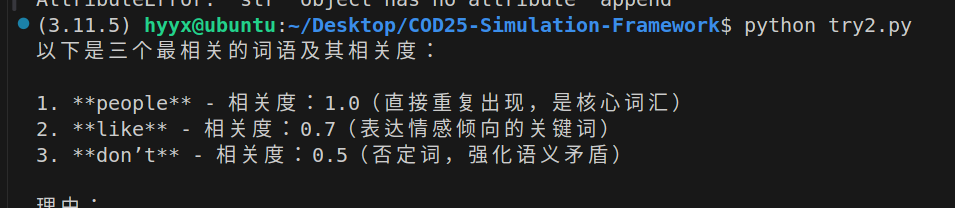
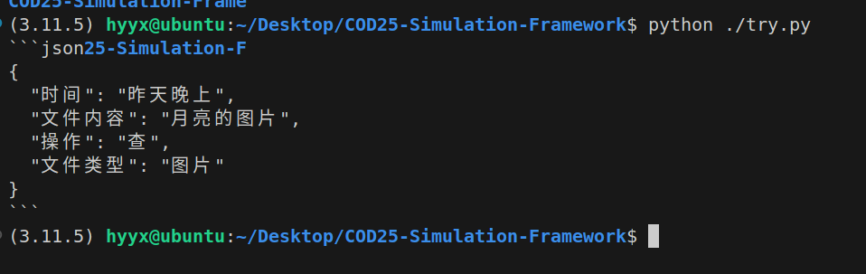

# 可行性报告

## 小组成员
- **队长**：叶梓文
- **队员**：

## 目录
1. [概述](#1概述)
2. [需求分析](#2需求分析)
3. [技术可行性](#3技术可行性)
4. [进度可行性](#4进度可行性)
5. [风险评估](#5风险评估)
6. [结论和建议](#6结论和建议)

---

## 1. 概述
我的主要任务是调研人工智能服务层的可行性，研究`ARKFS`组已完成的任务，并说明我们的人工智能服务层搭建的可行性。

## 2. 需求分析
### 2.1 存储文件标记与根CID索引
- 如何实现对于文件打标与根`CID`的索引存储

### 2.2 实现文件打标和用户命令解析
- 如何将用户的命令解析为计算机可以识别的信号，以及如何将文件变为计算机可以识别的索引，以及具有强相关性的打标如何匹配，如“草”与“青草”


## 3. 技术可行性
### 3.1 大语言模型自身优势
#### 3.1.1 文本内容深度理解与分析
- 我们还需要验证是否大模型可以正常为我们的文件进行标记

- 我们验证大模型是否可以判断相关性，同时我们也将根据相关性来决定最后他们是否相关，如图片"青草"相关程度为0.98，“青草”与“草”相关程度为0.98，那么图片与“草”相关程度我们认为他们为0.98*0.98，并设置阈值，决定是否图片与用户输入的要求“草”相关程度>阈值，而决定它是否使我们需要的文件。

- ```python
  
  
  with open('etry.txt', 'r', encoding='utf-8') as file:
      text_content = file.read()
  text_content+=",给上述文本找出三个最相关的词语,返回他们的文本与相关度(0-1)"
  
  from openai import OpenAI
  
  client = OpenAI(api_key="***********", base_url="https://api.deepseek.com")
  
  response = client.chat.completions.create(
      model="deepseek-chat",
      messages=[
          {"role": "system", "content": "You are a helpful assistant"},
          {"role": "user", "content": text_content},
      ],
      stream=False
  )
  
  print(response.choices[0].message.content)
  ```

  返回值如下所示

  ```
  1. **people** - 相关度：1.0（直接重复出现，是核心词汇）  
  2. **like** - 相关度：0.7（表达情感倾向的关键词）  
  3. **don’t** - 相关度：0.5（否定词，强化语义矛盾）
  ```

  

  可以见得该任务(人工智能处理文本文件打标)可以实现，但是计算机视觉处理图片目前可以使用谷歌与gpt，由于网络，价格问题，我们将该问题先后置。

- 首先，我们必须要得到验证，大模型是否可以实现用户语义解析与文件的相应标记

  在这里，我们使用了一个实例

  ```
  from openai import OpenAI
  
  client = OpenAI(api_key="************************",//这里使用的是我的url，不予显示 base_url="https://api.deepseek.com")
  
  response = client.chat.completions.create(
      model="deepseek-chat",
      messages=[
          {"role": "system", "content": "You are a helpful assistant"},
          {"role": "user", "content": "帮我以时间,文件内容,操作,文件类型为下面一段话打标,要求返回值为NULL或是相应的英文组成的数组,文件操作为：移，删，改，查：帮我找一张昨天晚上拍的月亮的图片"},
      ],
      stream=False
  )
  
  print(response.choices[0].message.content)
  ```

  下面是返回的内容

  

这也说明了我们的中间服务层是可以搭建在LInux环境下的，如果要把文件更细分，就加入细分的种类即可。

### 3.2 实现根CID与标签关联度的索引存储
- 目前来看，在我们进行了更多的调研后，我们希望实现的`AI`服务层本身就是拥有自己的硬件的，也就是说：我们的数据是有两条通路的，一条是通向`AI`服务层的，一条是通向分布式系统的，这样能够保证即使在AI服务层崩溃以后，我们仍能够正常传输我们的文件。也就是说如图所示

- ```mermaid
  graph TD
      %% 用户与系统交互
      User[用户] -->|1.提交CID| MiddleLayer[中间层/AI服务]
      
      %% 中间层处理流程
      MiddleLayer -->|2.临时存储索引| Memory[内存缓存]
       MiddleLayer -->|7.对于文件进行标记| Memory[内存缓存]
      MiddleLayer -->|3.持久化存储| IPFS[IPFS分布式存储]
      
      %% 数据流向
      Memory -->|4.定期同步| MiddleLayer
      IPFS -->|5.内容检索| MiddleLayer
      MiddleLayer -->|6.返回结果| User
      
      %% 组件样式
      style User fill:#f9f,stroke:#333
      style MiddleLayer fill:#bbf,stroke:#333
      style Memory fill:#ff9,stroke:#333
      style IPFS fill:#9f9,stroke:#333
  ```

- 等后续我们详细学习了如何接受外界的传递CID，这里我们会更详细的给出相应的`python`的代码，同时IPFS协议完全支持通过Python代码进行交互，包括内容的上传（接受）、下载（输出）和索引管理。

- ```python
  import ipfshttpclient
  
  # 连接到本地/远程节点
  client = ipfshttpclient.connect('/ip4/127.0.0.1/tcp/5001/http')
  
  # 上传文件/数据到IPFS（接受输入）
  res_add = client.add('example.txt')  # 文件
  res_add_json = client.add_json({'key': 'value'})  # 直接添加JSON
  
  print(f"存储成功，CID: {res_add['Hash']}")
  
  # 从IPFS获取内容（输出）
  content = client.cat(res_add['Hash'])  # 返回bytes
  print(f"获取内容: {content.decode('utf-8')}")
  ```

  这是示例，事实上，在使用时，中间层应该是多部处理器，防止中心化后导致的易崩溃，但是由于我们的设备有限，大概率我们建立时时中间服务层只有一部设备，等待后续玩具式`IPFS`分布式系统建立后，才能进行更详细的尝试。

## 4. 进度可行性
根据现实情况，我们需要设计一系列的验证试验：

1.我们需要开通一个相应的(尽量是老师推荐的)人工智能处理图片的端口，并导入部分图片进行测试。

2.对于文本文件，目前虽然有可以使用且效果不错的api，但是我们需要更多的案例精心测试

3.我们需要分为两批，分别更加学习`javascript，python`，从而保证我们再加代码时可以互相讨论与帮助

4.我们需要初步搭建一个`IPFS`分布式网络（这也需要我们共同使用虚拟机），并尝试使用代理，并利用代码将中间层与用户层结合，进行交互，观察是否可以中间层搭载在一部或多部电脑上。

5.我们需要尝试一下能否利用人工智能将自然语言分为很多层次，从而在`ARKFS`组的基础上实现多文本处理。

## 5. 风险评估
### 5.1工作简介

初步调用的人工智能的`API`验证了其可行性，同时确认`python`代码作为中间层的可行性，更加完善了中间层的结构，同时确认了后续我们需要的资源与不同文件的数据具体由什么人工智能处理。

### 5.2 研究困难

- 技术难点清单：1.目前我上述的测试仍然限于短文本处理，如果要进行扩展，可能还要加一层人工智能处理。2.对于很短的文本和很长的文本，如果我们都用固定数量的标记，很可能会造成相关性不足或是相关词汇不足以显示充足的相关性。3.目前不清楚是否我们的IPFS搭建以后能够很好的链接`AI`服务层，同时不清楚其余之前的组做的工作，如更加完善的监视机制是否可以继承。（代码语言不一样，可能不兼容）
- 资源限制说明：由于国内的处理可视化的人工智能相对落后，我们可能需要一定的经费用于关于Google，GPT的API端口的使用，同时，我们可能需要老师提供一些适合的网络资源，从而方便我们链接域外的端口时保证我们稳定的端口，或是推荐我们选择一个合适的处理图片的API端口（最好是能将文本，图片统一处理的，如化为base64后在处理）。

### 5.3 .工作方向

后续人工智能中间处理层部分的工作需要尽快解决好具体用什么来处理图文件打标，否则我们的的任务只能限于文本打标，这里`ARKFS`组只实现了文本文件的处理；另外，我们还需要尽快搭建起相应地`IPFS`分布式系统与用户前端(这个应该是已有的工作，不过使用`javascript`写的网页)，进行与中间服务层的具体链接；最后，我们还需要处理好虚拟机上与本机上与外网的接口问题，保证与api端口的稳定连接。

## 6. 结论和建议
- 在之前的工作上，我们初步确认了以`deepseek`进行文本打标，自然语言处理的开发，目前我们还需要进一步的工作是寻找可行的图片处理人工智能，将自然语言多层次处理，支持多命令模式，同时在更加了解具体的实现过程以后，对于中间层的结构的改革，我们还希望更加具体的对于实际任务进行实现，从而进一步验证我们的任务是可行的。在后面的任务如果超过了我们的预期，我们将会继承之前已有的工作，并适量删减我们的目标，如：图片文件的详细打标或是多层次处理自然语言。
