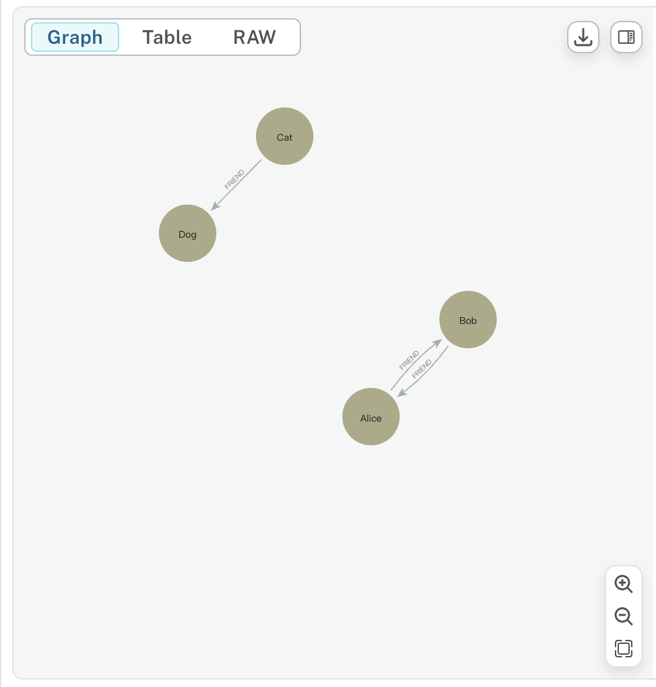

### 可行性报告(分布式图文件系统)

### 1. 概述

我们需要实现一个分布式图文件系统，其包含中央图数据库和分布式存储节点两个部分，中央图数据库用于存储文件和标签所构成的图结构，存储节点用于存储每个文件切割后形成的分片文件，多个节点合作存储所有的分片文件形成分布式文件存储系统。

### 2. 技术依据

**2.1 neo4j 实现中央图数据库**

图数据库（graph database）是一种通过图结构进行数据存储和查询的数据库，数据库中包含节点、边和属性等信息。该类系统的核心是图，它将存储中的数据元素与数据节点及节点之间表示关系的边集合直接关联。这些关系可以将存储中的数据直接连接起来，并且在许多场景中，能够通过一次操作便完成检索。在众多图数据库系统中，Neo4j 是一款可以本地部署的，基于Java的高性能的图数据库，其使用的是 Cypher 查询语言高效实现了图数据操作，如查询、插入和删除。

在 OSH 往届相关项目中基本都使用 Neo4j 作为文件系统图结构的存储工具，我们也将使用这一工具构建中央图数据库。我们将参考 OSH2024-vivo50 的设计，使用标签和文件作为节点，通过对文件名和文件内容为文件添加合适的标签，并将文件和标签之间利用 IS_TAG 连接，实现基于标签的高效文件索引系统。


以下是一个简单的利用 neo4j 进行建立图节点和边的例子，以及查询的过程和结果：

```cypher
// 创建节点和边
CREATE (p1:Person {name: 'Alice', age: 34})
CREATE (p2:Person {name: 'Bob', age: 28})
CREATE (p3:Person {name: 'Cat', age: 34})
CREATE (p4:Person {name: 'Dog', age: 28})
CREATE (p1)-[:FRIEND]->(p2)
CREATE (p2)-[:FRIEND]->(p1)
CREATE (p3)-[:FRIEND]->(p4)

// 查询并返回所有形如 Person --[FRIEND]-> Person 关系
MATCH (n:Person)-[r:FRIEND]->(m:Person) RETURN n, r, m
```




**2.2 Nginx 反向代理**

Nginx（Engine X）是一个高性能的 HTTP 和反向代理服务器，同时也是一个 IMAP/POP3/SMTP 代理服务器。它以事件驱动架构和异步非阻塞机制著称，能够高效处理高并发连接，广泛应用于各类 Web 服务和应用中。Nginx 可作为反向代理服务器，部署在系统前端，统一接收用户请求，将客户端请求转发到后端服务器，提高系统的安全性和可扩展性。

我们将使用 Nginx 将多用户的输入转发到 AI 打标记服务器以及 IPFS/Filecoin 文件存储服务器，实现高并发连接的处理。


例如以下核心代码（引用自 `OSH2024-vivo50/nginx.conf` 中的一部分) 监听本机的 8080 端口，接收所有请求，并将它们以负载均衡的方式代理到两个后端服务（分别运行在本机的 8001 和 8002 端口）。

```nginx
upstream domain {
    server localhost:8001;
    server localhost:8002;
}

server {  
    listen       8080;        
    server_name  localhost;

    location / {
        proxy_pass http://domain;
        proxy_set_header Host $host:$server_port;
    }
}
```

**2.3. 分布式存储**

在过去的项目中 JuiceFS 常被用于分布式存储的工具，在我们的项目中将使用多人共享，去中心化的 IPFS/Filecoin 存储结构，将图文件系统中的文件分片存储到多个流动的客户端节点中。

