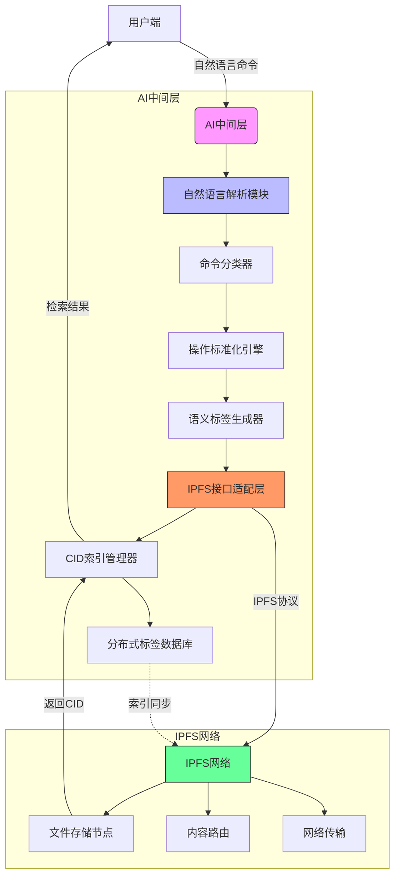

### 中期工作汇报

#### 是什么：

我们的工作是在分布式系统与用户端之间在2024年`ArkFs`组的基础上实现简单的`AI`服务层,我们的工作内容大致是要求我们的人工智能层可以进行如下的功能：

1.能够解析用户端命令，并且能够将自然语言解析为标准的格式，从而便于分类进行任务处理

2.能够依靠对于用户自然语言处理后的标签，向`IPFS`系统发射信号，从而对其进行命令，如"move,delete"等等

3.能够对于输入文件进行解析，从而可以做到对于文件添上恰当的标签，同时根据用户提供的根CID建立一个索引表，实现方便文件的搜寻

我们的人工智能服务层是作为方便用户对于文件的处理的中间服务层

下面是一个图片展示我们的更加详细的图片（展示我们的框架的一部分）。
    

#### 为什么：

我们为什么要搭建一个人工智能工作层。

##### 1.条件：

1.大模型的能力已经足够强大，可以将自然语言高准确地进行分类，同时计算机视觉与文本处理都有着合适的现成的高精度的API，并且都可以比较简单地利用python进行使用，这一方面说明了我们可以实现自然语言的处理，也可以正确的对于不同的文件进行打标。

2.IPFS协议目前在python中有着可以使用的连接，可以保证我们的源文件可以发送信息

##### 2.优势与作用

1.实现了自然语言直接到文件的处理，使得用户的学习成本大大下降，方便了用户的使用

2.实现了文件的智能处理和动态索引

3.实现了文件的智能标签建立

##### 3.建立原因与动机

由于IPFS协议是一个强关联的分布式系统，用户如果直接和IPFS协议搭建的分布式系统进行交互，必须处处处理CID，这十分的不直观，同时，另一方面，由于传统的IPFS协议没有文件夹，我们如果想要加入更多的内容，例如文件夹处理，搭建了服务层后，也可以进行扩展，同时，我们将一部分非必要的信息存储到了中间服务层，减轻了用户的存储压力，也减少了信息在网络中的传播，本身可以提高效率。而且，我们的工作可以将计算机语言语义化，从而使得用户使用逻辑更加清晰。IPFS原生缺乏文件权限管理，AI层可通过中间表实现：定义“用户-文件CID-访问权限”关系，结合加密链接。最后，由于我们中间层的任务并不能太多，所以我们限制其较少的功能，保证轻量化。

#### 怎么做：

我们怎么搭建这个人工智能中间服务层的具体原理与操作：

我们借助了之前的组的经验：由于本地部署训练出来的模型数据少，同时需要耗费大量资源，性能差，我们采取使用现成的api连接的方式。

目前来看：国内的计算机视觉可用的API只有阿里云，腾讯云，国外的连接可能会因为网络问题出现卡顿

而国内的文本打标：deepseek的性能也比较好，我们会倾向于使用deepseek的api调用

另一方面：我们利用可能需要建立一个虚拟的文件夹对应，因为IPFS协议本身是没有文件夹管理的，在中间服务层，并修改`ArkFS`组原来的代码，（他们实现了对于文件的删，移，查，改）我们将在他们的工作的基础上进行：

1.如果我们后续选择了建立虚拟文件夹，我们需要修改他们的操作，原来是在现有文件夹操作，那么现在就要加入新的数据结构，同时改为在虚拟文件夹中操作，而且虚拟文件夹将存入的是根CID，而不是实际的文件了

2.我们将会建立索引表：根CID与标签之间的索引表，这样才能在用户提供特征以后进行相应的查询。

3.我们需要利用人工智能大模型的API对于我们的自然语言进行解析，得到规整的操作信息，同时在这一方面：我们有可能需要处理多重语言输入与解析：如先干什么，后干什么，得到两个标签。

4.我们还需要在人工智能中间层实现与其余模块的正确交互，例如代理和分布式系统。

5.我们的中间层很可能是部署在某一台设备上的，但是实际在生产环境时是可以分布式处理的，所以仍然保持了去中心性。