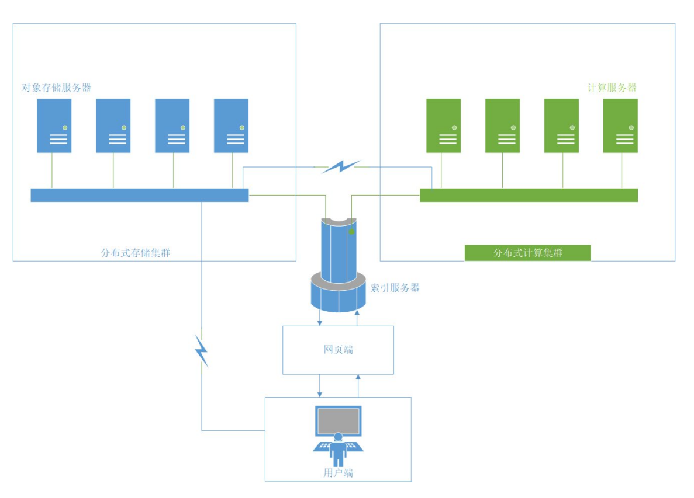

# 图文件系统
**产生背景**：面对不断膨胀的数据规模，现有的基于树形结构的文件系统设计与人类基于信息“相关性”的思维方式不符，从而导致人类不能按照自然的思维模式对存储的信息进行检索。在这种思维的扭曲下，分类困难、文件起名困难、找不到文件等令人头疼的问题便层出不穷。为了更好地体现文件之间关联性，用图的结构来描述文件之间的关系显然比树形结构更具优势。现有的图文件系统、图数据库等技术，都是对这种新思路的探索。
**图文件系统现状**：典型的图文件系统采用算法自动对各种文件进行标记，通过寻找共同的标记进行建图，并且在图数据库中对图进行维护。这些项目说明了图文件系统技术的可行性与各种理论上优点，但是仍然不够成熟。它们目前仅仅持在单机上运行，一方面，由同一台机器完成存储、标记、索引等所有工作，容易造成资源的紧张；另一方面，单机信息规模的索引仍在人的记忆能力之内，对图文件系统的需求不突出。这几方面的原因导致图文件系统并未能够投入实用。
## 分布式图文件系统DisGraFS
**概述**：基于上述现状，21年OSH研究小组x-DisGraFS提出了分布式图文件系统（DisGraFS, Distributed Graph Filesystem）。在分布式机群的规模上，图文件系统能够实现所管理的信息规模的扩大与各类资源的均衡分配，从而在超出人类记忆能力的信息规模上体现出图文件系统相对于传统树形结构的优越性。
**项目结构**：x-DisGraFS使用集中式元数据架构JuiceFS，借助分布式高性能计算引擎Ray生成文件标签并将其以图结构存储在图数据库Neo4j，通过主机（Master）对从机（Slave）的存储空间以及算力的合理调度以及在主机的指导下用户与从机之间的直接对接，以实现一个高效的、用户友好的、高可扩展性的分布式图文件系统。
### 系统架构

DisGraFS分为5个组成部分：索引服务器、分布式存储集群、分布式计算集群、网页端和客户端。
- **索引服务器**：进行分布式存储集群与分布式计算集群的通信、网页端部署的位置，目前也负责构建与维护图数据库（但若有需要，也可将图数据库的部分分离出去）。
- **分布式存储集群**：基于Juicefs的分布式储存系统，管理、存储和调度分布式存储系统中的所有文件。
- **分布式计算集群**：基于Ray的分布式计算系统，将文本语义识别、图像识别、语音识别以及元数据提取等任务分散给计算集群中的多个计算机。
- **网页端**：直观显示文件所构成的图，并将用户在图上的操作以友好方式展示。
- **客户端**：客户端负责直接接收用户对文件系统的操作，并针对不同的平台对其进行实现。
### 操作实现
一个完整的文件系统需支持新增文件、文件搜索、获取文件和删除文件的操作。下面分别介绍这些操作在DisGraFS上的实现流程。
- **新增文件**：
1. 用户在网页端启动客户端，将分布式存储集群挂载在本地电脑上；
2. 用户将需要上传的文件直接拖入JuiceFS对应的盘，此时分布式存储系统对文件进行切分并通过合理调度将文件分布式地存储在存储集群中；
3. 分布式存储集群发信息给索引服务器，索引服务器将信息转发给分布式计算集群，开始对文件进行内容识别并且打出标签；
4. 打标完成后，分布式计算集群将标签以及文件其他信息一起发送返回给索引服务器，索引服务器根据收到的标签以及文件信息更新图数据库。
- **文件搜索**：
1. 用户在网页端提出文件搜索请求，网页端将搜索关键字（可以是标签，也可以是文件名）上传至索引服务器；
2. 索引服务器根据关键字创建搜索语句，在图数据库中搜索，将具有相关标签的所有文件通过图和列表两种方式返回至网页端；
3. 用户可以根据网页端返回的图，直接通过点击获得某一文件的标签与信息，或者获得具有某一标签的所有文件，实现根据文件内容进行搜索以及在图上直接搜索邻顶的目标。
- **文件获取**：
1. 用户在关键词搜索返回的文件中找到自己需要的文件，点击打开文件的按键，服务器将消息传给JuiceFS分布式存储集群；
2. 分布式存储集群找到需要打开的文件，将其下载到用户本地存储空间并将其打开。
- **删除文件**：
1. 用户在客户端提出删除文件的请求，客户端将目标文件名上传至索引服务器；
2. 索引服务器将信息传递给分布式存储集群，分布式存储集群将文件删除；
3. 索引服务器根据文件名删除图数据库中对应的节点，更新图数据库。