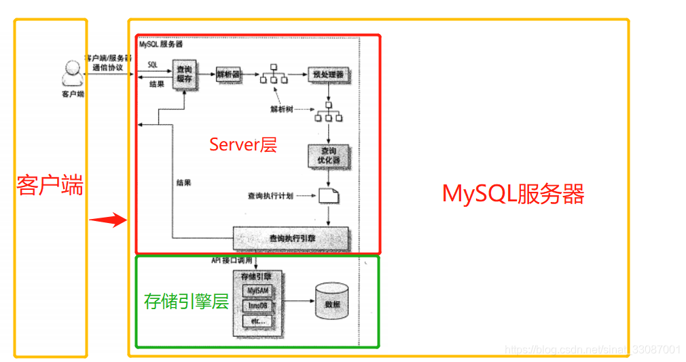
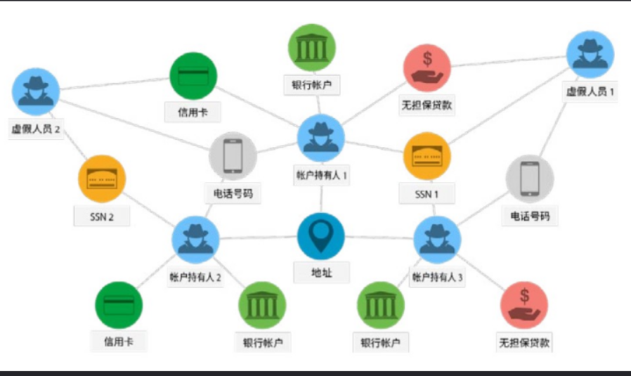
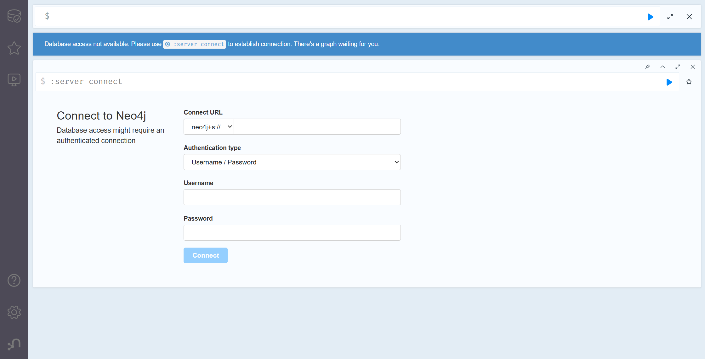

# 数据库
**定义**：数据库（Database）是一个用于存储、管理和检索数据的系统，它以一种结构化的方式组织数据，使得数据能够被有效地存储、查询、更新和维护。
**分布式系统数据库**：在分布式系统中，数据库扮演着至关重要的角色，它不仅负责数据的存储和管理，还需要处理分布式系统中与数据一致性、可用性、可靠性等相关的一系列挑战。分布式系统要求数据库能够在多个物理节点（通常分布在不同的计算机或地理位置）之间分配和管理数据，因此，在设计和使用时，需要考虑很多传统单机数据库系统所没有的因素。
## 作用
- **数据存储与管理（Data Storage and Management）**：分布式系统中的数据库负责存储和管理海量数据，将数据分散到多个节点以实现高容量和高性能。
- **提供数据访问接口（Data Access Interface）**：数据库为应用程序提供统一的数据访问接口，隐藏分布式系统的复杂性。
- **确保数据一致性（Data Consistency）**：在多节点环境下，数据库负责协调数据的读写操作，确保数据一致性。
- **支持高可用性与容错（High Availability and Fault Tolerance）**：数据库通过数据复制和故障转移机制，确保系统在节点故障时仍能正常运行。
- **提高性能与并行处理（Performance and Parallel Processing）**：数据库利用分布式架构并行处理查询和事务，提升响应速度。
- **数据分片与负载均衡（Data Sharding and Load Balancing）**：数据库将数据分片存储到不同节点，分散负载，避免单点压力。
- **支持事务处理（Transaction Support）**：分布式数据库提供事务支持，确保多节点操作的原子性、一致性、隔离性和持久性。
- **数据恢复与备份（Data Recovery and Backup）**：数据库通过日志和快照机制，支持数据恢复和灾难备份。
## 主要结构

- **客户端**：发送查询请求。
- **负载均衡器/代理层**：路由请求到合适的节点。
- **数据库节点**：存储分片数据和副本，执行本地操作。
## 数据关系
- **分布式关系数据库（Distributed Relational Database）**：数据库支持SQL和表结构，数据分布在多节点但保持关系模型。常见数据库有Google Spanner、Citus。
- **分布式NoSQL数据库（Distributed NoSQL Database）**：非关系型数据库，强调高可扩展性和灵活性，通常牺牲强一致性，支持高并发。为了应对不断膨胀的数据规模，以Neo4j为代表的、符合人类联想式思维方式的图数据库逐渐在分布式系统中展现了优势，并在我们的图文件系统中发挥重要作用。
## 图数据库
图数据库（Graph Database，GDB）是一种用于存储和处理图形数据的数据库，该系统的一个关键概念是图，它将数据建模为图结构，将存储中的数据项与数据节点以及节点间表示关系的边的集合进行关联，从而使用节点之间以边相连的图结构进行数据的表示。这些关系使得数据库中的数据直接链接在一起，易于检索。图数据库专为处理复杂关系和连接数据而设计，适用于存储和查询高度互联的数据，与传统的关系型数据库相比，图的文件关联形式与人类的思考模式类似，在处理涉及多个关系的数据时，更具用户友好性。
### 关键概念
- **节点**：构成一张图的基本元素是节点和关系，节点和关系都可以附带属性。
- **关系**：通过关系可以找到很多关联的数据，比如节点集合，关系集合以及他们的属性集合。
- **属性**：节点和关系都可以设置自己的属性。 属性是由Key-Value键值对组成，键名是字符串。
- **路径**：路径由至少一个节点，通过各种关系连接组成，经常是作为一个查询或者遍历的结果。
- **遍历**：遍历一张图就是按照一定的规则，跟随他们的关系，访问关联的的节点集合。
## Neo4j
**概述**：Neo4j是一个高性能的NOSQL图形数据库，它将结构化数据存储在图上而不是表中。它是一个采用了高性能分布式集群架构设计的Java持久化高性能引擎，通过该引擎实现了一个可扩展、符合ACID的图形数据库，并可用于自托管和云产品。项目Neo4j查询语言为cypher，编写语言为java。

### Neo4j使用方法
- **下载与安装**：
下载地址见[官网](https://neo4j.com/download/)，分为Community Edition和Enterprise Edition版本，一般使用免费的Community Edition，适合学习和小型项目。
- **启动Neo4j**：
1. 根据Neo4j安装位置，进入Neo4j目录；
2. 通过```neo4j console```运行Neo4j；
3. Ctrl+C或运行```neo4j stop```可以停止Neo4j。
- **访问Neo4j Browser**：

1. 打开浏览器，输入```http://localhost:7474```进入Neo4j的默认端口；
2. 第一次登录时，用户名为neo4j，密码在初次登录后需设置。
### 利用Cypher语言查询数据
**概述**：Cypher是Neo4j的查询语言，语法直观，类似SQL但专注于图结构。
**创建数据**：
- **创建节点**：创建一个标签为Person的节点，属性为name和age。
```cypher
CREATE (p:Person {name: "Alice", age: 25})
```
- **创建关系**：创建两个节点并用KNOWS关系连接。
```cypher
CREATE (p1:Person {name: "Alice"})-[:KNOWS]->(p2:Person {name: "Bob"})
```
**查询数据**
- **匹配节点**：查找名为Alice的Person节点。
```cypher
MATCH (p:Person)
WHERE p.name = "Alice"
RETURN p
```
- **匹配关系**：返回所有KNOWS关系中的人物对。
```cypher
MATCH (p1:Person)-[:KNOWS]->(p2:Person)
RETURN p1.name, p2.name
```
**更新数据**
- **修改属性**：
```cypher
MATCH (p:Person {name: "Alice"})
SET p.age = 26
RETURN p
```
- **添加关系**：
```cypher
MATCH (p1:Person {name: "Alice"}), (p2:Person {name: "Charlie"})
CREATE (p1)-[:KNOWS]->(p2)
```
**删除数据**
- **删除节点**：找到与Alice有关的所有关系，并利用DETACH自动删除相关关系。
```cypher
MATCH (p:Person {name: "Alice"})
DETACH DELETE p
```
- **删除关系**：
```cypher
MATCH (p1:Person)-[r:KNOWS]->(p2:Person)
WHERE p1.name = "Alice" AND p2.name = "Bob"
DELETE r
```
### Neo4j工具
**Neo4j Browser**：内置 Web 界面，用于运行 Cypher 和可视化图。
**Neo4j Desktop**：图形化管理工具，适合本地开发。
**Python编程接口**：使用neo4j或py2neo库。
```python
# Python API
from neo4j import GraphDatabase
driver = GraphDatabase.driver("bolt://localhost:7687", auth=("neo4j", "password"))
with driver.session() as session:
    session.run("CREATE (p:Person {name: 'Dave'})")
```