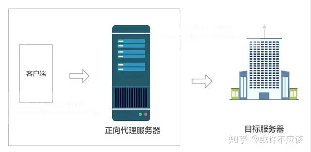
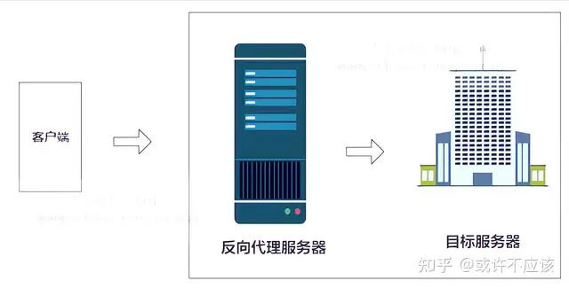

# Web代理
**定义**：Web代理，也称为代理服务器，是一种在客户端和目标服务器之间充当中介传递角色的服务器。它的作用是代表客户端（如浏览器）与互联网进行交互，代替客户端向目标服务器发送请求，并将目标服务器的响应返回给客户端。Web代理在网络安全、隐私保护、缓存优化和访问控制等方面具有重要作用。
## 工作原理
- **客户端请求**：用户的浏览器（或其他客户端应用）向代理服务器发送请求，要求访问某个网页或资源。
- **代理转发请求**：代理服务器收到请求后，代替客户端向目标网站或服务器发送请求。
- **目标服务器响应**：目标服务器处理请求并将响应发送回代理服务器。
- **代理转发响应**：代理服务器接收到目标服务器的响应后，再将响应转发给客户端。
## Web代理类型
### 正向代理（Forward Proxy）
**定义**：正向代理是客户端（如浏览器）与服务器之间的一个中介。客户端请求网络资源时，先请求正向代理服务器，然后代理服务器再代表客户端去访问目标服务器，获取数据返回给客户端。
**常见用途**：
- **隐藏真实IP**：通过正向代理，客户端的真实IP地址可以被隐藏，只有代理服务器的IP地址被目标服务器看到。
- **访问受限制资源**：例如，访问某些被墙的内容，正向代理可以帮助绕过访问限制。
**例子**：
- **企业/学校的网络代理**：公司或学校常常使用正向代理来限制员工或学生访问某些网站，或者监控浏览记录。比如，所有员工上网时，都会先通过公司设置的代理服务器，然后由代理服务器向外界请求网页。
### 反向代理（Reverse Proxy）
**定义**：反向代理与正向代理相反，代理服务器不代表客户端，而是代表服务器接受外部的请求。客户端对外请求的内容是通过反向代理服务器转发到内部服务器的，外部客户端并不直接访问目标服务器。
**常见用途**：
- **负载均衡**：反向代理可以将请求分配到多台服务器，从而实现负载均衡，提高服务器的处理能力。
- **增强安全性**：反向代理服务器可以隐藏内部服务器的真实IP和细节，增强安全性。
- **缓存加速**：反向代理可以缓存常见的请求，减轻后端服务器的压力，提高响应速度。
**例子**：
- **网站的反向代理**：例如，大型网站（如淘宝、Google等）使用反向代理来管理数百台服务器。用户请求的所有内容首先到达反向代理，代理服务器决定将请求转发到哪台实际的服务器上处理。
## 正向代理和反向代理
反向代理和正向代理的区别就是：**正向代理代理客户端，反向代理代理服务器**；正向代理代理的是客户端，我们需要在客户端进行一些代理的设置；而反向代理代理的是服务器，作为客户端的我们是无法感知到服务器的真实存在的。
- **正向代理**：正向代理服务器位于客户端和服务器之间，为了向服务器获取数据，客户端要向代理服务器发送一个请求，并指定目标服务器，代理服务器将目标服务器返回的数据转交给客户端。这里客户端是要进行一些正向代理的设置的。
- **反向代理**：反向代理，其实客户端对代理是无感知的，客户端不需要任何配置就可以访问，我们只需要将请求发送到反向代理服务器，由反向代理服务器去选择目标服务器获取数据后，在返回给客户端，此时反向代理服务器和目标服务器对外就是一个服务器，暴露的是代理服务器地址，隐藏了真实服务器IP地址。


## 正向代理Squid
**概述**：我们的项目中，为了确保大模型服务器的安全，我们将在客户端和大模型API之间增加正向代理。当考虑到安全性时，Squid是最推荐的正向代理。Squid是一个开源的缓存代理服务器，支持HTTP、HTTPS、FTP等协议，支持SSL/TLS加密，专为管理出站流量设计，内置了访问控制列表、日志记录和内容过滤功能，这些功能有助于保护服务器的出站连接，确保数据传输安全。
**适用场景**：适合需要缓存和基本安全功能的中小型环境，尤其是在企业网络中管理服务器出站流量。
### 优势
- **灵活的访问控制**：提供强大的访问控制列表，可根据IP地址、域名、时间等限制访问。
- **日志和流量分析**：支持详细的日志记录，方便审计和监控出站流量。
- **内容安全性**：内置内容过滤功能，可阻止访问恶意网站或不适当的内容。
- **数据保护**：支持SSL/TLS加密，确保数据传输安全。
- **高可扩展性和性能**：Squid经过多年的发展，已经被优化为能够处理大量并发请求的高性能代理服务器。它支持负载均衡、分布式部署，可以满足大规模企业或互联网服务提供商的需求。
### 使用方法
- **安装Squid**：
Squid通常运行在Linux或类Unix系统，一般使用包管理器运行```sudo apt update && sudo apt install squid```安装。
- **配置```Squid.conf```文件**:
1. ```Squid.conf```文件是Squid的配置文件，默认路径通常在```/etc/squid/squid.conf```；
2. 设置Squid的**监听端口**，默认端口是3128，可以根据需要修改；
3. 通过配置**访问控制列表**控制哪些客户端可以使用代理；
4. Squid默认会记录访问日志，需要配置**日志文件**的位置；
5. Squid作为正向代理时，会缓存经过的内容，需要配置缓存目录和大小。
```
# 设置Squid的监听端口
http_port 3128
# 定义访问控制列表：允许的IP地址段
acl allowed_ips src 192.168.1.0/24
# 设置访问控制：仅允许定义的IP地址访问
http_access allow allowed_ips
# 拒绝所有其他访问
http_access deny all
# 设置日志文件位置
access_log /var/log/squid/access.log squid
# 设置缓存目录，指定路径和大小（例如：最大1000MB的缓存）
cache_dir ufs /var/spool/squid 1000 16 256
```
- **启动和测试**：
配置完成后，可以启动Squid服务以使更改生效，并检查Squid状态。
```
# 启动Squid服务
sudo systemctl restart squid
# 检查Squid状态
sudo systemctl status squid
```
- **客户端配置**：
配置好Squid作为正向代理后，需要在客户端（如浏览器或操作系统）配置代理服务器。通常，客户端需要设置代理地址和端口，指定Squid服务器的IP地址和端口号。
## 反向代理Nginx
**概述**：Nginx是异步框架的网页服务器，也可以用作反向代理、负载平衡器和HTTP缓存。Nginx最初由vivo50组引入，用作分布式Web服务器的反向代理，通过负载平衡提高性能。我们项目将沿用vivo50的分布式Web服务器设置和Nginx反向代理。
### 优势
- **安全性**：可以隐藏后端服务器的真实IP地址，提高安全性。
- **负载平衡**：可以实现负载均衡，根据不同的算法，将请求分配给不同的后端服务器，提高性能和可用性。
- **传输性能**：可以实现缓存和压缩，减少网络传输和后端服务器的负担。
- **灵活性**：可以实现URL重写和跳转，根据不同的规则，修改或重定向请求和响应。
- **资源监控**：可以实现日志记录和监控，方便分析和调试。