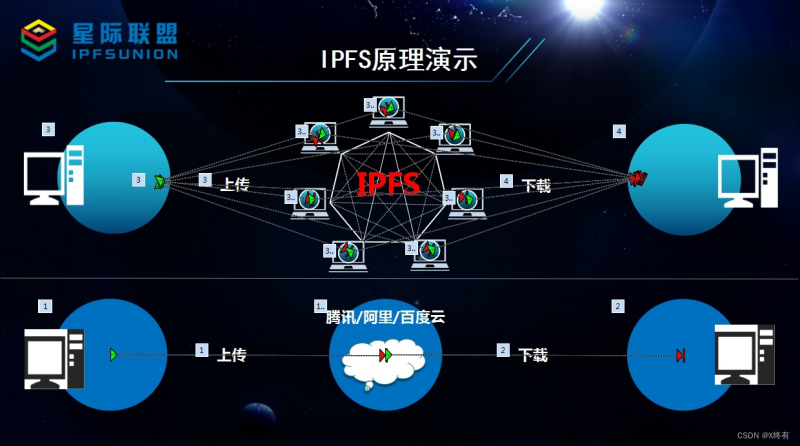

# IPFS 原理与架构
## IPFS原理演示

## IPFS数据块结构

## 相关工具和资源
以下是一些有用的 IPFS 和 Filecoin 相关工具和资源链接：
- [IPFS 官方文档](https://docs.ipfs.tech/)
- [Filecoin 官方文档](https://filecoin.io/)
- [IPFS-FUSE](https://github.com/ipfs-shipyard/ipfs-fuse)
- [Pinata](https://www.pinata.cloud/)（IPFS 托管服务）
- [Lotus 客户端](https://lotus.filecoin.io/)（Filecoin 官方客户端）
## IPFS概述
IPFS是InterPlanetary File System的缩写。它是一个分布式的网络传输协议，可以把文件分成很多小块放到服务器的不同地方，然后用一种特别的方式来寻找和传输这些小块。这样，我们就可以更快、更安全、更抗容错地存储文件了。
可能你会问，像腾讯云、阿里云这样的OSS文件存储系统，和这个有什么区别呢？
举个例子，当阿里云被攻击的时候，你的OSS还能访问吗？是不能的。这就是中心化系统带来的弊端。还有，当你在阿里云上传一张图片，你觉得你有所有权吗？管理员同样也可以对你的图片为所欲为。这也是中心化的一大弊端：图片所有者权限少于系统管理者。
## IPFS关键结构
- **分布式哈希表（DHT）**：IPFS使用分布式哈希表来实现内容寻址。每个文件都由其内容的哈希值唯一标识。DHT 允许节点根据内容的哈希值快速定位文件，而不需要中心化的服务器。
- **内容寻址**：IPFS使用内容寻址来定位文件，而不是基于位置的寻址。这意味着文件的位置由其内容决定，而不是存储它的物理位置。只要文件内容不变，其地址就保持一致。
- **点对点通信**：IPFS节点通过点对点通信协议相互连接。节点可以请求文件、发布文件、转发请求等。这种点对点通信模型有助于提高网络的可扩展性和抗攻击性。
- **内容缓存**：IPFS节点可以缓存他们访问过的文件内容，以便在将来请求时更快地提供文件。这种缓存机制有助于减少重复传输和提高网络性能。
- **数据块**：IPFS 将文件分割为数据块，并使用 Merkle DAG（有向无环图）来组织这些数据块。文件被分割成多个小块，每个块都有一个唯一的哈希值。这些块通过 Merkle DAG 连接起来，形成一个树状结构。这种结构不仅便于数据的快速检索和验证，还支持高效的版本控制和增量更新。例如，当文件发生局部修改时，只需要更新修改部分的块及其相关的哈希值，而无需重新计算整个文件的哈希。
- **内容生产者和消费者**：IPFS允许任何节点成为内容的生产者和消费者。节点可以发布自己的内容，并为其他节点提供访问。同时，节点也可以请求并检索其他节点发布的内容。
## 激励机制与Filecoin
Filecoin是建立在IPFS之上的激励层，它通过区块链技术为存储提供者和用户创建了一个去中心化的存储市场。在Filecoin网络中，存储提供者（矿工）通过提供存储空间和带宽来获取Filecoin代币作为奖励。用户则需要支付Filecoin代币来购买存储服务。
## IPFS的实现原理
IPFS作为P2P文件系统，其实现原理的关键在于IPFS节点的内部结构和节点间的协作方式。通过与“智能共享书架系统”的类比，我们可以轻松理解IPFS的工作方式。

### IPFS节点内部结构（类比“智能书架”）
#### 身份（身份证+数字签名）
每个书架都有一个独一无二的“身份证”（公私钥对），就像每个人的指纹一样。这个身份证不仅证明了书架的身份，还确保了传输数据的安全性：
- **数字签名**：当你从某个书架借书时，书架会用它的私钥给书签上“防伪标签”，确保这本书没有被篡改。
- **身份验证**：其他书架可以通过公钥验证这本书确实来自该书架。
#### 仓库（智能储物格）
每个书架都有许多“智能储物格”，每个格子存放一本书的一个章节（文件块）。
当一本新书存入书架时：
- 系统会将书拆分成多个章节（分块）。
- 每个章节会被生成一个唯一的“哈希标签”（内容的指纹）。
- 章节被分配到空闲的储物格中。
**特点**：
- 如果两本书的某章节内容完全相同，它们会共用同一个储物格（去重机制）。
- 哈希标签是不可伪造的，只要内容不变，标签就永远不变。
#### Merkle DAG（立体书目录）
每本书的章节通过立体目录组织起来：
- 每个章节有自己的哈希标签。
- 整本书也有一个“根哈希标签”，它是所有章节哈希值的汇总。
**类比**：
- 打开一本书的目录，你会看到每个章节的标题（哈希标签）。
- 点击某个章节标题，会展开显示更细的子章节。
- 这种层级结构让文件的管理和验证变得高效。
#### 块交换协议（图书漂流规则）
当你想要借一本书时：
- 系统会计算这本书的“特征码”（根哈希）。
- 在共享网络中广播“求书信号”。
- 其他书架会直接邮寄相关的章节复印件给你。
**优势**：
- 不需要依赖中央图书馆，书架之间直接沟通。
- 如果某个书架离线，其他书架可以提供备份。
#### 分布式哈希表（动态书单地图）
所有书架共同维护一张“实时更新的书单地图”：
- 地图记录了每本书的存储位置，类似于“《三体》第1-5章在书架A”、“《三体》第6-10章在书架B”的记录。
**特点**：
- 地图每5分钟自动同步更新。
- 即使某个书架离线，地图依然能指引你找到其他备份。
#### 内容路由（智能导航）
当你输入书名时：
- 系统查询书单地图，找到存储位置。
- 规划最优取书路径（比如优先联系最近的书架）。
- 实时追踪章节传输进度。
**类比**：
- 就像外卖平台帮你规划最快的送餐路线一样。
#### 缓存机制（热门书展区）
每个书架会自动保留最近借阅的10本热门书：
- 这些书摆放在入口处的“展示区”，方便快速取用。
- 如果有人再次借阅这些书，书架可以直接提供，而无需重新从远处获取。
#### 引脚（藏书室珍藏）
对特别重要的书（如古籍、珍本），书架会将其放入带密码锁的“藏书室”永久保存：
- 即使其他书架清理旧书，这些书也不会被删除。
- 这类似于“重要数据长期保存”的功能。
### 不同IPFS节点间的协作方式（共享书架网络）
#### 点对点连接（直接邮寄）
书架之间通过“专用快递通道”（libp2p协议）直接交流：
- 不需要经过中央图书馆（去中心化）。
- 数据传输安全且高效。
#### 内容发现与交换（图书漂流）
当你想借一本书时，典型流程如下：

**解释**：
- 书架A收到你的请求后，向整个网络广播“求书信号”。
- 书架B和书架C分别邮寄相关章节。
- 书架A将所有章节组装成完整的书并交给你。
#### 数据冗余与高可用性
如果某个书架突然断电（节点离线）：
- 只要网络中有其他书架存有副本，你依然能借到完整的书。
- 这就是去中心化存储的最大优势,即使部分节点失效，系统依然正常运行。
## IPFS使用方法
- **安装IPFS**：
1. 从[IPFS 官方网站](https://docs.ipfs.tech/install/ipfs-desktop/#windows)下载并安装IPFS客户端。
2. 在终端运行```ipfs init```初始化IPFS节点，这会生成一个唯一的节点密钥。
3. 启动IPFS守护进程```ipfs daemon```，这样便加入了IPFS网络。
- **上传文件**：
1. 创建一个文件：```echo "测试内容" > test.txt```。
2. 将文件添加到IPFS中，```ipfs add test.txt```，这会返回一个哈希值，这就是文件的地址。
- **查看文件**：
1. 使用```ipfs cat <哈希值>```查看文件内容。
2. 也可以通过浏览器访问```http://127.0.0.1:8080/ipfs/<哈希值>```来查看文件。
- **固定文件（Pin）**：
1. 使用```ipfs pin add <哈希值>```将文件固定到本地节点，这样即使其他节点离线，也可以访问该文件。
2. 查看已固定的文件```ipfs pin ls```。
- **使用IPNS**:：
1. IPNS（InterPlanetary Name System）是 IPFS 的命名系统，可以为文件创建一个易于记忆的名称。
2. 创建一个 IPNS 记录：```ipfs name publish <哈希值>```，然后可以通过这个名称访问文件。
## IPFS文件上传和下载过程
### 上传文件
1. 将IPFS的依赖引入到项目工程中，并进行配置。
2. 编写控制类，写出上传接口。例如，使用Java编写的控制类，通过```@Autowired```注解注入```IpfsService```服务，并编写```@PostMapping("/upload")```注解的方法来处理上传请求。
3. 实现上传方法，例如```uploadIpfs```方法，该方法接收一个```MultipartFile```对象，代表要上传的文件。
4. 使用```IPFS```客户端实例，调用```add```方法将文件添加到IPFS网络中，该方法会返回一个包含文件哈希值的```MerkleNode```对象。
5. 从```MerkleNode```对象中获取文件的CID（Content Identifier），这是文件在IPFS网络中的唯一标识符。
6. 将文件CID返回给用户，用户可以通过这个CID来访问或分享文件。
### 下载文件
1. 用户通过CID访问或分享文件时，可以使用```ipfs cat <CID>```命令来访问文件内容。
2. IPFS网络会通过CID找到存储该文件的节点，并直接从这些节点下载数据。
3. 如果安装了下载软件，也可以使用这些软件接管下载，例如使用FDM等。
4. 除了P2P下载方式，IPFS还可以采用公共网关创建分享链接的方式分享文件。公共网关本身也是一个IPFS节点，但拥有公网IP，连接速度较快，可以帮助其他节点下载。