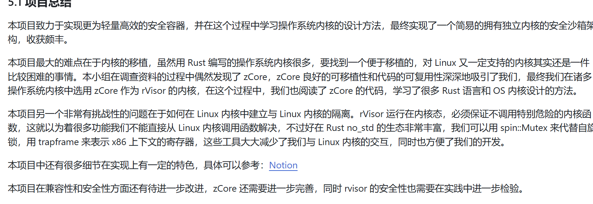

     1.Rust改写Harmony LiteOS OSH2024 链接：[OSH-2024/RushToLight: This is a repository trying to rewrite LiteOS-M kernel using Rust to improve its security.](https://github.com/OSH-2024/RushToLight)

​     2.Rust改写HuaWei LiteOS OSH2024 链接：[OSH-2024/Rage_of_dUST](https://github.com/OSH-2024/Rage_of_dUST)

​    改的MMU单元的multipool.c，与所有相关头文件

​    3.Rust改写Linux内核的一部分 6.8.4kernal/trace/bpf-trace [OSH-2024/mkdir](https://github.com/OSH-2024/mkdir)

​    4.Rust重写FreeRTOS [OSH-2024/mustrust](https://github.com/OSH-2024/mustrust) 

5. OSH-2019/x-qwq Rust 改写 seL4 微内核
6. 包括arcOS的文件系统、进程调度和内存分配：[OSH-2023/Actus_Neopiritus: OSH group proj 2023](https://github.com/OSH-2023/Actus_Neopiritus)
7. 但我们实现了他的核心功能: 可以进行虚实页的映射，堆栈分配，内核线程的RR调度，以及部分 MMIO 外设，没有实现用户态是因为参考了 Redleaf 的设计 [OSH-2022/x-QvQ: A Course Project for USTC OSH 2022](https://github.com/OSH-2022/x-QvQ)

​    8.Rust改写freeRTOS

[OSH-2019/x-rust-freertos: FreeRTOS rewritten in Rust.](https://github.com/OSH-2019/x-rust-freertos)

9. 改写sel4

[OSH-2019/x-qwq: x-qwq created by GitHub Classroom](https://github.com/OSH-2019/x-qwq)

10.  rust改写freertos[OSH-2019/x-rust-freertos: FreeRTOS rewritten in Rust.](https://github.com/OSH-2019/x-rust-freertos)
11. **基于 Rust 和 WebAssembly 的互联网分布式文件系统**[OSH-2020/x-gkd: x-gkd created by GitHub Classroom](https://github.com/OSH-2020/x-gkd)
12. 

[OSH-2020/x-chital: x-chital created by GitHub Classroom](https://github.com/OSH-2020/x-chital)

13.x-seLVM项目旨在利用Lua虚拟机，使seL4内核对平台的依赖转化为Lua虚拟机对平台的依赖，从而扩大seL4微内核的平台适用范围。主要的技术为将内核的部分接口进行改写，并将其注册到Lua程序中，实现运行在Lua虚拟机上的seL4内核。[OSH-2021/x-seLVM: seL4 Virtual Machine](https://github.com/OSH-2021/x-seLVM)

14.

15.Rust 改写 Unikraft[OSH-2022/x-runikraft: 2022 USTC 011705 (OSH) Course Project of Runikraft Group](https://github.com/OSH-2022/x-runikraft)

16.本项目为使用 Rust 编程语言组织一个注重性能、并发和安全的微内核操作系统。[OSH-2022/x-realism: Yet Another OS Group's project repository.](https://github.com/OSH-2022/x-realism)