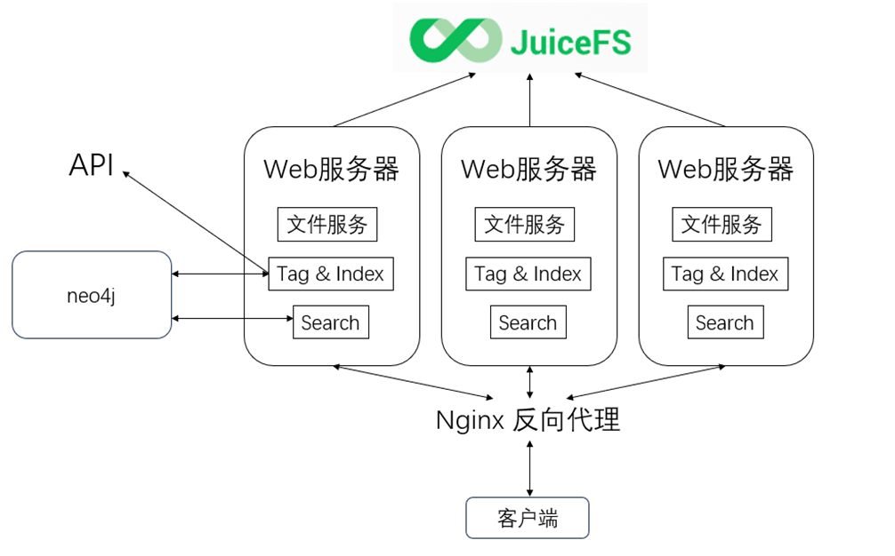

# 项目概述
VIVO50在My-Glow项目的基础上,主要针对图文件系统中多模态数据的处理和中央服务器的负载均衡问题。项目首先尝试使用多模态大模型来生成向量化索引;同时,项目尝试利用反向代理优化中央服务器,从而使得该图文件系统可以更好地支持不同格式的文件,并拥有更好的性能;最后,项目在优化往年架构的同时,将本地存储优化为在JuiceFS中存储,还加入了多种检索文件的方式,使得对文件的检索更加准确.
# 项目结构
项目结构如图,一共分为六个模块.

## 客户端
同My-Glow的客户端.
## web服务器
相当于My-Glow的中央服务器和web服务器的合并,每个web服务器都包含了My-Glow的纠删码模块,MySQL和Ray模块.同时,项目加入了多个web服务器用来进行负载均衡.
## JuiceFS
JuiceFS是一种面向云计算的分布式文件系统,专门为大规模数据存储和大数据分析场景设计.它将元数据存储在数据库中(如MySQL),而将文件数据存储在对象存储或分布式存储上,采用存算分离架构,通过元数据与数据分离存储来实现高性能,低成本的文件存储解决方案.其核心实现原理包括元数据管理,数据存储,缓存机制,并发控制和一致性保证.JuiceFS提供了丰富的API,适用于各种形式数据的管理,分析,归档,备份,可以在不修改代码的前提下无缝对接大数据,机器学习,人工智能等应用平台,为其提供海量,弹性,低价的高性能存储.
## Nginx反向代理
Nginx是异步框架的网页服务器,可以用作反向代理,负载平衡器和HTTP缓存.Nginx将项目的多个web服务器通过方向代理和负载平衡整合,以一个虚拟"服务器"的形式与客户端互动.
## API
大模型打标的接口,vivo50项目利用llamaindex(将大语言模型和外部数据连接在一起的工具)进行打标.我们的项目将使用ArkFS项目的AIOS进行打标,可能需要对该接口进行一定的修改.
## neo4j
同My-Glow的neo4j.