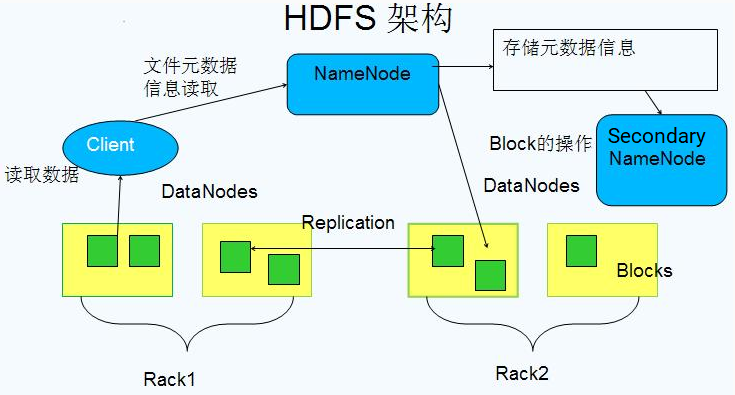
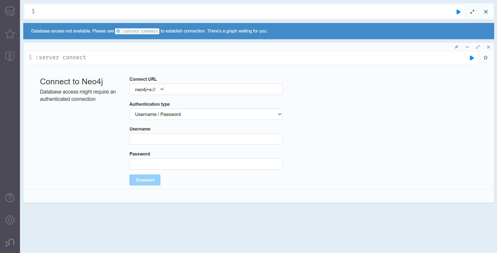
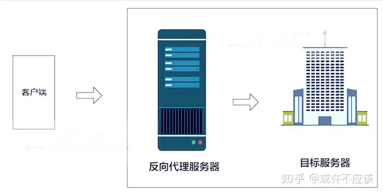
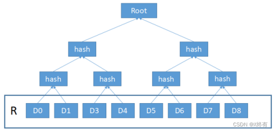
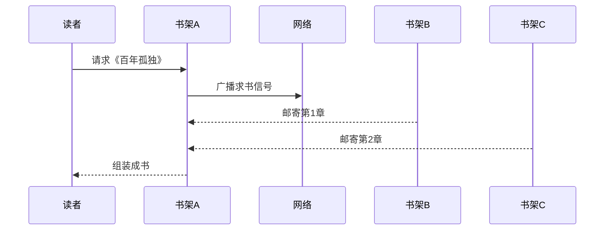
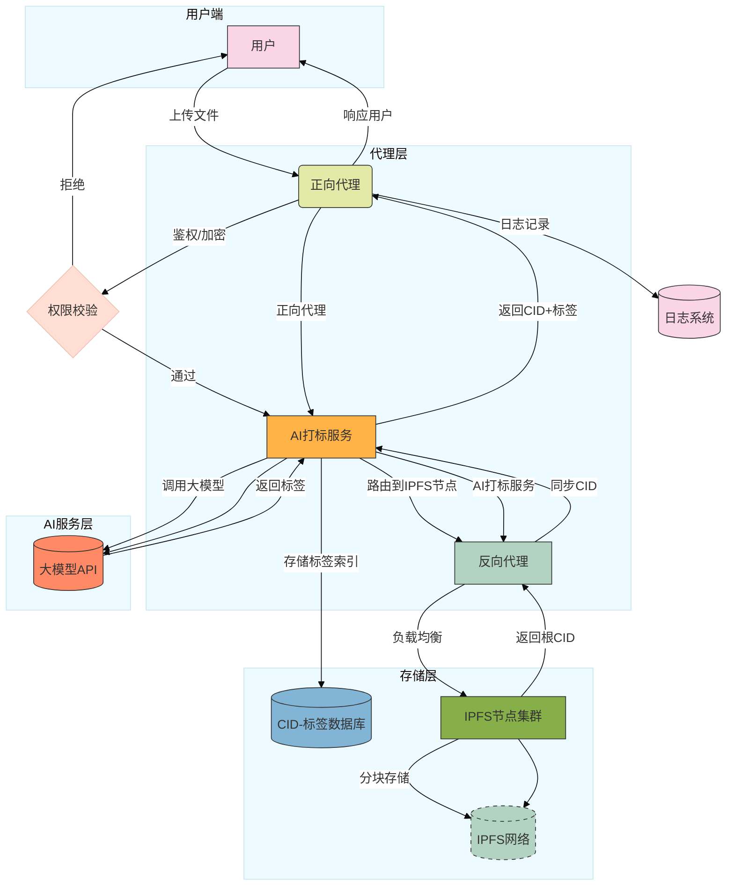
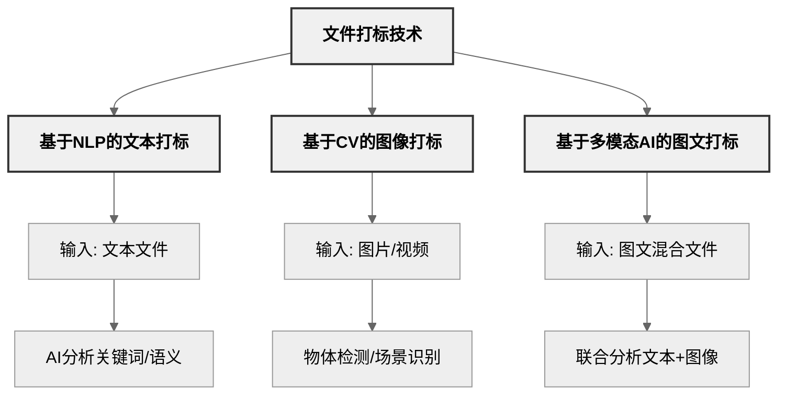

## 目录
- [调研报告](#调研报告)
  - [小组成员](#小组成员)
  - [项目概述](#项目概述)
  - [项目背景](#项目背景)
    - [文件系统](#文件系统)
      - [核心功能](#核心功能)
      - [工作原理](#工作原理)
      - [分布式文件系统](#分布式文件系统)
        - [分布式文件系统主要结构](#分布式文件系统主要结构)
        - [核心目标](#核心目标)
        - [主流类型](#主流类型)
    - [数据库](#数据库)
      - [作用](#作用)
      - [数据库主要结构](#数据库主要结构)
      - [数据关系](#数据关系)
      - [图数据库](#图数据库)
        - [关键概念](#关键概念)
      - [Neo4j](#neo4j)
        - [Neo4j使用方法](#neo4j使用方法)
        - [利用Cypher语言查询数据](#利用cypher语言查询数据)
        - [Neo4j工具](#neo4j工具)
    - [图文件系统](#图文件系统)
      - [分布式图文件系统DisGraFS](#分布式图文件系统disgrafs)
        - [系统架构](#系统架构)
        - [操作实现](#操作实现)
    - [Web代理](#web代理)
      - [Web代理工作原理](#web代理工作原理)
      - [Web代理类型](#web代理类型)
        - [正向代理](#正向代理)
        - [反向代理](#反向代理)
      - [正向代理和反向代理](#正向代理和反向代理)
      - [正向代理Squid](#正向代理squid)
        - [Squid优势](#squid优势)
        - [使用方法](#使用方法)
      - [反向代理Nginx](#反向代理nginx)
        - [Nginx优势](#nginx优势)
    - [IPFS原理与架构](#ipfs原理与架构)
      - [IPFS原理演示](#ipfs原理演示)
      - [IPFS数据块结构](#ipfs数据块结构)
      - [相关工具和资源](#相关工具和资源)
      - [IPFS概述](#ipfs概述)
      - [IPFS关键结构](#ipfs关键结构)
      - [激励机制与Filecoin](#激励机制与filecoin)
      - [IPFS的实现原理](#ipfs的实现原理)
        - [IPFS节点内部结构（类比“智能书架”）](#ipfs节点内部结构类比智能书架)
          - [身份（身份证+数字签名）](#身份身份证数字签名)
          - [仓库（智能储物格）](#仓库智能储物格)
          - [MerkleDAG（立体书目录）](#merkledag立体书目录)
          - [块交换协议（图书漂流规则）](#块交换协议图书漂流规则)
          - [分布式哈希表（动态书单地图）](#分布式哈希表动态书单地图)
          - [内容路由（智能导航）](#内容路由智能导航)
          - [缓存机制（热门书展区）](#缓存机制热门书展区)
          - [引脚（藏书室珍藏）](#引脚藏书室珍藏)
        - [不同IPFS节点间的协作方式（共享书架网络）](#不同ipfs节点间的协作方式共享书架网络)
          - [点对点连接（直接邮寄）](#点对点连接直接邮寄)
          - [内容发现与交换（图书漂流）](#内容发现与交换图书漂流)
          - [数据冗余与高可用性](#数据冗余与高可用性)
      - [IPFS使用方法](#ipfs使用方法)
      - [IPFS文件上传和下载过程](#ipfs文件上传和下载过程)
        - [上传文件](#上传文件)
        - [下载文件](#下载文件)
  - [立项依据](#立项依据)
    - [项目结构](#项目结构)
    - [IPFS/Filecoin文件储存系统](#ipfsfilecoin文件储存系统)
    - [基于ARKFS的大模型人工智能打标](#基于arkfs的大模型人工智能打标)
  - [重要性/前瞻性分析](#重要性前瞻性分析)
    - [应用场景](#应用场景)
    - [IPFS/Filecoin体系的优势](#ipfsfilecoin体系的优势)
    - [基于大模型的分布式图文件系统的优势](#基于大模型的分布式图文件系统的优势)
  - [相关工作](#相关工作)
    - [基于大语言模型的文件系统](#基于大语言模型的文件系统)
      - [AIOS](#aios)
      - [ArkFS](#arkfs)
    - [分布式存储系统](#分布式存储系统)
    - [图文件系统](#图文件系统-1)
      - [Neo4j](#neo4j-1)
      - [x-DisGraFS](#x-disgrafs)
      - [My-Glow](#my-glow)
  - [参考文献](#参考文献)

# 调研报告

## 小组成员
* 叶梓文
* 陈聆袆
* 娄彦轩
* 黄袁宇轩
* 刘雅兰
* 许傲施

## 项目概述
我们项目题目为**融合ArkFS+vivo50后，加入IPFS/Filecoin的分布式存储设计**。简单来说，我们计划建立一个支持Web服务的分布式存储系统（类似于睿客云盘等云存储工具），使多名用户可以使用网络高效方便地共享文件。

## 项目背景

### 文件系统
**定义**：文件系统是操作系统用于明确磁盘或分区上的文件的方法和数据结构，是在磁盘上组织文件的方法，是操作系统中负责管理和存储文件信息的软件机构。它由三部分组成：与文件管理有关的软件、被管理的文件以及实施文件管理所需要的数据结构。从系统角度来看，文件系统是对文件存储器空间进行组织和分配，负责文件的存储并对存入的文件进行保护和检索的系统。具体地说，它负责为用户建立文件，存入、读出，修改、转储文件，控制文件的存取，当用户不再使用时撤销文件等。
#### 核心功能
- **文件管理**：给文件命名、分配存储空间、记录文件位置。
- **目录结构**：通过文件夹（目录）组织文件，通常是树形结构，近年来为了适应不断膨胀的数据规模，也出现了应用于分布式系统上的图形文件结构。
- **权限控制**：决定哪些用户可以读、写或执行文件。
- **数据存取**：提供快速访问文件内容的方式。
- **空间管理**：追踪存储设备的可用空间和已用空间。
#### 工作原理
- **分区**：存储设备通常会被分成多个分区，每个分区可以有自己的文件系统。
- **元数据**：文件系统用元数据（如文件名、大小、创建时间）来描述文件，存储在特定的表格中（例如FAT表的“文件分配表”或NTFS的“主文件表”）。
- **数据块**：文件内容被分成小块存储在磁盘上，文件系统负责追踪这些块的位置。
- **索引**：通过目录和索引，快速定位文件。
#### 分布式文件系统
**定义**:分布式文件系统（Distributed File System, DFS）是一种允许多个计算机通过网络共享和管理文件的文件系统。它将文件存储在多个物理位置（节点或服务器）上，但对用户来说，看起来像是在访问一个统一的本地文件系统。分布式文件系统的核心目标是高可用性、可扩展性和容错性，广泛应用于云计算、大数据处理和分布式计算领域。
##### 分布式文件系统主要结构

- **客户端（Client）**：用户通过客户端访问文件，客户端负责与系统通信。
- **元数据服务器（Metadata Server）**：存储文件的元数据（如文件名、位置、权限），也叫“名字节点”（NameNode）。
- **数据服务器（Data Server）**：存储文件内容的实际节点，也叫“数据节点”（DataNode）。
- **网络协议**：用于客户端与服务器、服务器之间的通信（如TCP/IP、HTTP、IPFS/filecoin）。
##### 核心目标
- **分散存储**：文件数据分布在多个节点上，而不是集中在一个设备。
- **统一命名空间**：用户通过一个全局路径访问文件，无需关心具体存储位置。
- **数据复制**：文件通常有多个副本，存储在不同节点，以提高可靠性和容错性。
- **负载均衡**：通过分散读写请求，提升性能。
##### 主流类型
- **集中式元数据架构（Master-Slave结构）**：该架构使用一个或多个专门的元数据服务器（Master）来管理文件的元数据，而数据存储在多个数据节点（Slave）上。代表性系统有HDFS和JuiceFS
- **对等结构（P2P结构）**：该架构没有单一的中心元数据服务器，所有节点既存储数据也管理元数据。代表性系统有IPFS，也是我们项目计划采用的分布式文件系统。
- **对象存储架构**：该架构的对象存储系统通常基于分布式存储架构，使用唯一的ID而不是传统的文件路径来访问数据。
- **共享存储架构（NAS结构）**：该架构的多个服务器共享同一存储设备，通常通过网络文件协议进行访问。

### 数据库
**定义**：数据库（Database）是一个用于存储、管理和检索数据的系统，它以一种结构化的方式组织数据，使得数据能够被有效地存储、查询、更新和维护。
**分布式系统数据库**：在分布式系统中，数据库扮演着至关重要的角色，它不仅负责数据的存储和管理，还需要处理分布式系统中与数据一致性、可用性、可靠性等相关的一系列挑战。分布式系统要求数据库能够在多个物理节点（通常分布在不同的计算机或地理位置）之间分配和管理数据，因此，在设计和使用时，需要考虑很多传统单机数据库系统所没有的因素。
#### 作用
- **数据存储与管理（Data Storage and Management）**：分布式系统中的数据库负责存储和管理海量数据，将数据分散到多个节点以实现高容量和高性能。
- **提供数据访问接口（Data Access Interface）**：数据库为应用程序提供统一的数据访问接口，隐藏分布式系统的复杂性。
- **确保数据一致性（Data Consistency）**：在多节点环境下，数据库负责协调数据的读写操作，确保数据一致性。
- **支持高可用性与容错（High Availability and Fault Tolerance）**：数据库通过数据复制和故障转移机制，确保系统在节点故障时仍能正常运行。
- **提高性能与并行处理（Performance and Parallel Processing）**：数据库利用分布式架构并行处理查询和事务，提升响应速度。
- **数据分片与负载均衡（Data Sharding and Load Balancing）**：数据库将数据分片存储到不同节点，分散负载，避免单点压力。
- **支持事务处理（Transaction Support）**：分布式数据库提供事务支持，确保多节点操作的原子性、一致性、隔离性和持久性。
- **数据恢复与备份（Data Recovery and Backup）**：数据库通过日志和快照机制，支持数据恢复和灾难备份。
#### 数据库主要结构

- **客户端**：发送查询请求。
- **负载均衡器/代理层**：路由请求到合适的节点。
- **数据库节点**：存储分片数据和副本，执行本地操作。
#### 数据关系
- **分布式关系数据库（Distributed Relational Database）**：数据库支持SQL和表结构，数据分布在多节点但保持关系模型。常见数据库有Google Spanner、Citus。
- **分布式NoSQL数据库（Distributed NoSQL Database）**：非关系型数据库，强调高可扩展性和灵活性，通常牺牲强一致性，支持高并发。为了应对不断膨胀的数据规模，以Neo4j为代表的、符合人类联想式思维方式的图数据库逐渐在分布式系统中展现了优势，并在我们的图文件系统中发挥重要作用。
#### 图数据库
图数据库（Graph Database，GDB）是一种用于存储和处理图形数据的数据库，该系统的一个关键概念是图，它将数据建模为图结构，将存储中的数据项与数据节点以及节点间表示关系的边的集合进行关联，从而使用节点之间以边相连的图结构进行数据的表示。这些关系使得数据库中的数据直接链接在一起，易于检索。图数据库专为处理复杂关系和连接数据而设计，适用于存储和查询高度互联的数据，与传统的关系型数据库相比，图的文件关联形式与人类的思考模式类似，在处理涉及多个关系的数据时，更具用户友好性。
##### 关键概念
- **节点**：构成一张图的基本元素是节点和关系，节点和关系都可以附带属性。
- **关系**：通过关系可以找到很多关联的数据，比如节点集合，关系集合以及他们的属性集合。
- **属性**：节点和关系都可以设置自己的属性。 属性是由Key-Value键值对组成，键名是字符串。
- **路径**：路径由至少一个节点，通过各种关系连接组成，经常是作为一个查询或者遍历的结果。
- **遍历**：遍历一张图就是按照一定的规则，跟随他们的关系，访问关联的的节点集合。
#### Neo4j
**概述**：Neo4j是一个高性能的NOSQL图形数据库，它将结构化数据存储在图上而不是表中。它是一个采用了高性能分布式集群架构设计的Java持久化高性能引擎，通过该引擎实现了一个可扩展、符合ACID的图形数据库，并可用于自托管和云产品。项目Neo4j查询语言为cypher，编写语言为java。

##### Neo4j使用方法
- **下载与安装**：
下载地址见[官网](https://neo4j.com/download/)，分为Community Edition和Enterprise Edition版本，一般使用免费的Community Edition，适合学习和小型项目。
- **启动Neo4j**：
1. 根据Neo4j安装位置，进入Neo4j目录；
2. 通过```neo4j console```运行Neo4j；
3. Ctrl+C或运行```neo4j stop```可以停止Neo4j。
- **访问Neo4j Browser**：

1. 打开浏览器，输入```http://localhost:7474```进入Neo4j的默认端口；
2. 第一次登录时，用户名为neo4j，密码在初次登录后需设置。
##### 利用Cypher语言查询数据
**概述**：Cypher是Neo4j的查询语言，语法直观，类似SQL但专注于图结构。
**创建数据**：
- **创建节点**：创建一个标签为Person的节点，属性为name和age。
```cypher
CREATE (p:Person {name: "Alice", age: 25})
```
- **创建关系**：创建两个节点并用KNOWS关系连接。
```cypher
CREATE (p1:Person {name: "Alice"})-[:KNOWS]->(p2:Person {name: "Bob"})
```
**查询数据**
- **匹配节点**：查找名为Alice的Person节点。
```cypher
MATCH (p:Person)
WHERE p.name = "Alice"
RETURN p
```
- **匹配关系**：返回所有KNOWS关系中的人物对。
```cypher
MATCH (p1:Person)-[:KNOWS]->(p2:Person)
RETURN p1.name, p2.name
```
**更新数据**
- **修改属性**：
```cypher
MATCH (p:Person {name: "Alice"})
SET p.age = 26
RETURN p
```
- **添加关系**：
```cypher
MATCH (p1:Person {name: "Alice"}), (p2:Person {name: "Charlie"})
CREATE (p1)-[:KNOWS]->(p2)
```
**删除数据**
- **删除节点**：找到与Alice有关的所有关系，并利用DETACH自动删除相关关系。
```cypher
MATCH (p:Person {name: "Alice"})
DETACH DELETE p
```
- **删除关系**：
```cypher
MATCH (p1:Person)-[r:KNOWS]->(p2:Person)
WHERE p1.name = "Alice" AND p2.name = "Bob"
DELETE r
```
##### Neo4j工具
**Neo4j Browser**：内置 Web 界面，用于运行 Cypher 和可视化图。
**Neo4j Desktop**：图形化管理工具，适合本地开发。
**Python编程接口**：使用neo4j或py2neo库。
```python
# Python API
from neo4j import GraphDatabase
driver = GraphDatabase.driver("bolt://localhost:7687", auth=("neo4j", "password"))
with driver.session() as session:
	session.run("CREATE (p:Person {name: 'Dave'})")
```

### 图文件系统
**产生背景**：面对不断膨胀的数据规模，现有的基于树形结构的文件系统设计与人类基于信息“相关性”的思维方式不符，从而导致人类不能按照自然的思维模式对存储的信息进行检索。在这种思维的扭曲下，分类困难、文件起名困难、找不到文件等令人头疼的问题便层出不穷。为了更好地体现文件之间关联性，用图的结构来描述文件之间的关系显然比树形结构更具优势。现有的图文件系统、图数据库等技术，都是对这种新思路的探索。
**图文件系统现状**：典型的图文件系统采用算法自动对各种文件进行标记，通过寻找共同的标记进行建图，并且在图数据库中对图进行维护。这些项目说明了图文件系统技术的可行性与各种理论上优点，但是仍然不够成熟。它们目前仅仅持在单机上运行，一方面，由同一台机器完成存储、标记、索引等所有工作，容易造成资源的紧张；另一方面，单机信息规模的索引仍在人的记忆能力之内，对图文件系统的需求不突出。这几方面的原因导致图文件系统并未能够投入实用。
#### 分布式图文件系统DisGraFS
**概述**：基于上述现状，21年OSH研究小组x-DisGraFS提出了分布式图文件系统（DisGraFS, Distributed Graph Filesystem）。在分布式机群的规模上，图文件系统能够实现所管理的信息规模的扩大与各类资源的均衡分配，从而在超出人类记忆能力的信息规模上体现出图文件系统相对于传统树形结构的优越性。
**项目结构**：x-DisGraFS使用集中式元数据架构JuiceFS，借助分布式高性能计算引擎Ray生成文件标签并将其以图结构存储在图数据库Neo4j，通过主机（Master）对从机（Slave）的存储空间以及算力的合理调度以及在主机的指导下用户与从机之间的直接对接，以实现一个高效的、用户友好的、高可扩展性的分布式图文件系统。
##### 系统架构

DisGraFS分为5个组成部分：索引服务器、分布式存储集群、分布式计算集群、网页端和客户端。
- **索引服务器**：进行分布式存储集群与分布式计算集群的通信、网页端部署的位置，目前也负责构建与维护图数据库（但若有需要，也可将图数据库的部分分离出去）。
- **分布式存储集群**：基于Juicefs的分布式储存系统，管理、存储和调度分布式存储系统中的所有文件。
- **分布式计算集群**：基于Ray的分布式计算系统，将文本语义识别、图像识别、语音识别以及元数据提取等任务分散给计算集群中的多个计算机。
- **网页端**：直观显示文件所构成的图，并将用户在图上的操作以友好方式展示。
- **客户端**：客户端负责直接接收用户对文件系统的操作，并针对不同的平台对其进行实现。
##### 操作实现
一个完整的文件系统需支持新增文件、文件搜索、获取文件和删除文件的操作。下面分别介绍这些操作在DisGraFS上的实现流程。
- **新增文件**：
1. 用户在网页端启动客户端，将分布式存储集群挂载在本地电脑上；
2. 用户将需要上传的文件直接拖入JuiceFS对应的盘，此时分布式存储系统对文件进行切分并通过合理调度将文件分布式地存储在存储集群中；
3. 分布式存储集群发信息给索引服务器，索引服务器将信息转发给分布式计算集群，开始对文件进行内容识别并且打出标签；
4. 打标完成后，分布式计算集群将标签以及文件其他信息一起发送返回给索引服务器，索引服务器根据收到的标签以及文件信息更新图数据库。
- **文件搜索**：
1. 用户在网页端提出文件搜索请求，网页端将搜索关键字（可以是标签，也可以是文件名）上传至索引服务器；
2. 索引服务器根据关键字创建搜索语句，在图数据库中搜索，将具有相关标签的所有文件通过图和列表两种方式返回至网页端；
3. 用户可以根据网页端返回的图，直接通过点击获得某一文件的标签与信息，或者获得具有某一标签的所有文件，实现根据文件内容进行搜索以及在图上直接搜索邻顶的目标。
- **文件获取**：
1. 用户在关键词搜索返回的文件中找到自己需要的文件，点击打开文件的按键，服务器将消息传给JuiceFS分布式存储集群；
2. 分布式存储集群找到需要打开的文件，将其下载到用户本地存储空间并将其打开。
- **删除文件**：
1. 用户在客户端提出删除文件的请求，客户端将目标文件名上传至索引服务器；
2. 索引服务器将信息传递给分布式存储集群，分布式存储集群将文件删除；
3. 索引服务器根据文件名删除图数据库中对应的节点，更新图数据库。

### Web代理
**定义**：Web代理，也称为代理服务器，是一种在客户端和目标服务器之间充当中介传递角色的服务器。它的作用是代表客户端（如浏览器）与互联网进行交互，代替客户端向目标服务器发送请求，并将目标服务器的响应返回给客户端。Web代理在网络安全、隐私保护、缓存优化和访问控制等方面具有重要作用。
#### Web代理工作原理
- **客户端请求**：用户的浏览器（或其他客户端应用）向代理服务器发送请求，要求访问某个网页或资源。
- **代理转发请求**：代理服务器收到请求后，代替客户端向目标网站或服务器发送请求。
- **目标服务器响应**：目标服务器处理请求并将响应发送回代理服务器。
- **代理转发响应**：代理服务器接收到目标服务器的响应后，再将响应转发给客户端。
#### Web代理类型
##### 正向代理
**定义**：正向代理（Forward Proxy）是客户端（如浏览器）与服务器之间的一个中介。客户端请求网络资源时，先请求正向代理服务器，然后代理服务器再代表客户端去访问目标服务器，获取数据返回给客户端。
**常见用途**：
- **隐藏真实IP**：通过正向代理，客户端的真实IP地址可以被隐藏，只有代理服务器的IP地址被目标服务器看到。
- **访问受限制资源**：例如，访问某些被墙的内容，正向代理可以帮助绕过访问限制。
**例子**：
- **企业/学校的网络代理**：公司或学校常常使用正向代理来限制员工或学生访问某些网站，或者监控浏览记录。比如，所有员工上网时，都会先通过公司设置的代理服务器，然后由代理服务器向外界请求网页。
##### 反向代理
**定义**：反向代理（Reverse Proxy）与正向代理相反，代理服务器不代表客户端，而是代表服务器接受外部的请求。客户端对外请求的内容是通过反向代理服务器转发到内部服务器的，外部客户端并不直接访问目标服务器。
**常见用途**：
- **负载均衡**：反向代理可以将请求分配到多台服务器，从而实现负载均衡，提高服务器的处理能力。
- **增强安全性**：反向代理服务器可以隐藏内部服务器的真实IP和细节，增强安全性。
- **缓存加速**：反向代理可以缓存常见的请求，减轻后端服务器的压力，提高响应速度。
**例子**：
- **网站的反向代理**：例如，大型网站（如淘宝、Google等）使用反向代理来管理数百台服务器。用户请求的所有内容首先到达反向代理，代理服务器决定将请求转发到哪台实际的服务器上处理。
#### 正向代理和反向代理
反向代理和正向代理的区别就是：**正向代理代理客户端，反向代理代理服务器**；正向代理代理的是客户端，我们需要在客户端进行一些代理的设置；而反向代理代理的是服务器，作为客户端的我们是无法感知到服务器的真实存在的。
- **正向代理**：正向代理服务器位于客户端和服务器之间，为了向服务器获取数据，客户端要向代理服务器发送一个请求，并指定目标服务器，代理服务器将目标服务器返回的数据转交给客户端。这里客户端是要进行一些正向代理的设置的。
- **反向代理**：反向代理，其实客户端对代理是无感知的，客户端不需要任何配置就可以访问，我们只需要将请求发送到反向代理服务器，由反向代理服务器去选择目标服务器获取数据后，在返回给客户端，此时反向代理服务器和目标服务器对外就是一个服务器，暴露的是代理服务器地址，隐藏了真实服务器IP地址。


#### 正向代理Squid
**概述**：我们的项目中，为了确保大模型服务器的安全，我们将在客户端和大模型API之间增加正向代理。当考虑到安全性时，Squid是最推荐的正向代理。Squid是一个开源的缓存代理服务器，支持HTTP、HTTPS、FTP等协议，支持SSL/TLS加密，专为管理出站流量设计，内置了访问控制列表、日志记录和内容过滤功能，这些功能有助于保护服务器的出站连接，确保数据传输安全。
**适用场景**：适合需要缓存和基本安全功能的中小型环境，尤其是在企业网络中管理服务器出站流量。
##### Squid优势
- **灵活的访问控制**：提供强大的访问控制列表，可根据IP地址、域名、时间等限制访问。
- **日志和流量分析**：支持详细的日志记录，方便审计和监控出站流量。
- **内容安全性**：内置内容过滤功能，可阻止访问恶意网站或不适当的内容。
- **数据保护**：支持SSL/TLS加密，确保数据传输安全。
- **高可扩展性和性能**：Squid经过多年的发展，已经被优化为能够处理大量并发请求的高性能代理服务器。它支持负载均衡、分布式部署，可以满足大规模企业或互联网服务提供商的需求。
##### 使用方法
- **安装Squid**：
Squid通常运行在Linux或类Unix系统，一般使用包管理器运行```sudo apt update && sudo apt install squid```安装。
- **配置```Squid.conf```文件**:
1. ```Squid.conf```文件是Squid的配置文件，默认路径通常在```/etc/squid/squid.conf```；
2. 设置Squid的**监听端口**，默认端口是3128，可以根据需要修改；
3. 通过配置**访问控制列表**控制哪些客户端可以使用代理；
4. Squid默认会记录访问日志，需要配置**日志文件**的位置；
5. Squid作为正向代理时，会缓存经过的内容，需要配置缓存目录和大小。
```
# 设置Squid的监听端口
http_port 3128
# 定义访问控制列表：允许的IP地址段
acl allowed_ips src 192.168.1.0/24
# 设置访问控制：仅允许定义的IP地址访问
http_access allow allowed_ips
# 拒绝所有其他访问
http_access deny all
# 设置日志文件位置
access_log /var/log/squid/access.log squid
# 设置缓存目录，指定路径和大小（例如：最大1000MB的缓存）
cache_dir ufs /var/spool/squid 1000 16 256
```
- **启动和测试**：
配置完成后，可以启动Squid服务以使更改生效，并检查Squid状态。
```
# 启动Squid服务
sudo systemctl restart squid
# 检查Squid状态
sudo systemctl status squid
```
- **客户端配置**：
配置好Squid作为正向代理后，需要在客户端（如浏览器或操作系统）配置代理服务器。通常，客户端需要设置代理地址和端口，指定Squid服务器的IP地址和端口号。
#### 反向代理Nginx
**概述**：Nginx是异步框架的网页服务器，也可以用作反向代理、负载平衡器和HTTP缓存。Nginx最初由vivo50组引入，用作分布式Web服务器的反向代理，通过负载平衡提高性能。我们项目将沿用vivo50的分布式Web服务器设置和Nginx反向代理。
##### Nginx优势
- **安全性**：可以隐藏后端服务器的真实IP地址，提高安全性。
- **负载平衡**：可以实现负载均衡，根据不同的算法，将请求分配给不同的后端服务器，提高性能和可用性。
- **传输性能**：可以实现缓存和压缩，减少网络传输和后端服务器的负担。
- **灵活性**：可以实现URL重写和跳转，根据不同的规则，修改或重定向请求和响应。
- **资源监控**：可以实现日志记录和监控，方便分析和调试。

### IPFS原理与架构
#### IPFS原理演示

#### IPFS数据块结构

#### 相关工具和资源
以下是一些有用的 IPFS 和 Filecoin 相关工具和资源链接：
- [IPFS 官方文档](https://docs.ipfs.tech/)
- [Filecoin 官方文档](https://filecoin.io/)
- [IPFS-FUSE](https://github.com/ipfs-shipyard/ipfs-fuse)
- [Pinata](https://www.pinata.cloud/)（IPFS 托管服务）
- [Lotus 客户端](https://lotus.filecoin.io/)（Filecoin 官方客户端）
#### IPFS概述
IPFS是InterPlanetary File System的缩写。它是一个分布式的网络传输协议，可以把文件分成很多小块放到服务器的不同地方，然后用一种特别的方式来寻找和传输这些小块。这样，我们就可以更快、更安全、更抗容错地存储文件了。
可能你会问，像腾讯云、阿里云这样的OSS文件存储系统，和这个有什么区别呢？
举个例子，当阿里云被攻击的时候，你的OSS还能访问吗？是不能的。这就是中心化系统带来的弊端。还有，当你在阿里云上传一张图片，你觉得你有所有权吗？管理员同样也可以对你的图片为所欲为。这也是中心化的一大弊端：图片所有者权限少于系统管理者。
#### IPFS关键结构
- **分布式哈希表（DHT）**：IPFS使用分布式哈希表来实现内容寻址。每个文件都由其内容的哈希值唯一标识。DHT 允许节点根据内容的哈希值快速定位文件，而不需要中心化的服务器。
- **内容寻址**：IPFS使用内容寻址来定位文件，而不是基于位置的寻址。这意味着文件的位置由其内容决定，而不是存储它的物理位置。只要文件内容不变，其地址就保持一致。
- **点对点通信**：IPFS节点通过点对点通信协议相互连接。节点可以请求文件、发布文件、转发请求等。这种点对点通信模型有助于提高网络的可扩展性和抗攻击性。
- **内容缓存**：IPFS节点可以缓存他们访问过的文件内容，以便在将来请求时更快地提供文件。这种缓存机制有助于减少重复传输和提高网络性能。
- **数据块**：IPFS 将文件分割为数据块，并使用 Merkle DAG（有向无环图）来组织这些数据块。文件被分割成多个小块，每个块都有一个唯一的哈希值。这些块通过 Merkle DAG 连接起来，形成一个树状结构。这种结构不仅便于数据的快速检索和验证，还支持高效的版本控制和增量更新。例如，当文件发生局部修改时，只需要更新修改部分的块及其相关的哈希值，而无需重新计算整个文件的哈希。
- **内容生产者和消费者**：IPFS允许任何节点成为内容的生产者和消费者。节点可以发布自己的内容，并为其他节点提供访问。同时，节点也可以请求并检索其他节点发布的内容。
#### 激励机制与Filecoin
Filecoin是建立在IPFS之上的激励层，它通过区块链技术为存储提供者和用户创建了一个去中心化的存储市场。在Filecoin网络中，存储提供者（矿工）通过提供存储空间和带宽来获取Filecoin代币作为奖励。用户则需要支付Filecoin代币来购买存储服务。
#### IPFS的实现原理
IPFS作为P2P文件系统，其实现原理的关键在于IPFS节点的内部结构和节点间的协作方式。通过与“智能共享书架系统”的类比，我们可以轻松理解IPFS的工作方式。

##### IPFS节点内部结构（类比“智能书架”）
###### 身份（身份证+数字签名）
每个书架都有一个独一无二的“身份证”（公私钥对），就像每个人的指纹一样。这个身份证不仅证明了书架的身份，还确保了传输数据的安全性：
- **数字签名**：当你从某个书架借书时，书架会用它的私钥给书签上“防伪标签”，确保这本书没有被篡改。
- **身份验证**：其他书架可以通过公钥验证这本书确实来自该书架。
###### 仓库（智能储物格）
每个书架都有许多“智能储物格”，每个格子存放一本书的一个章节（文件块）。
当一本新书存入书架时：
- 系统会将书拆分成多个章节（分块）。
- 每个章节会被生成一个唯一的“哈希标签”（内容的指纹）。
- 章节被分配到空闲的储物格中。
**特点**：
- 如果两本书的某章节内容完全相同，它们会共用同一个储物格（去重机制）。
- 哈希标签是不可伪造的，只要内容不变，标签就永远不变。
###### MerkleDAG（立体书目录）
每本书的章节通过立体目录组织起来：
- 每个章节有自己的哈希标签。
- 整本书也有一个“根哈希标签”，它是所有章节哈希值的汇总。
**类比**：
- 打开一本书的目录，你会看到每个章节的标题（哈希标签）。
- 点击某个章节标题，会展开显示更细的子章节。
- 这种层级结构让文件的管理和验证变得高效。
###### 块交换协议（图书漂流规则）
当你想要借一本书时：
- 系统会计算这本书的“特征码”（根哈希）。
- 在共享网络中广播“求书信号”。
- 其他书架会直接邮寄相关的章节复印件给你。
**优势**：
- 不需要依赖中央图书馆，书架之间直接沟通。
- 如果某个书架离线，其他书架可以提供备份。
###### 分布式哈希表（动态书单地图）
所有书架共同维护一张“实时更新的书单地图”：
- 地图记录了每本书的存储位置，类似于“《三体》第1-5章在书架A”、“《三体》第6-10章在书架B”的记录。
**特点**：
- 地图每5分钟自动同步更新。
- 即使某个书架离线，地图依然能指引你找到其他备份。
###### 内容路由（智能导航）
当你输入书名时：
- 系统查询书单地图，找到存储位置。
- 规划最优取书路径（比如优先联系最近的书架）。
- 实时追踪章节传输进度。
**类比**：
- 就像外卖平台帮你规划最快的送餐路线一样。
###### 缓存机制（热门书展区）
每个书架会自动保留最近借阅的10本热门书：
- 这些书摆放在入口处的“展示区”，方便快速取用。
- 如果有人再次借阅这些书，书架可以直接提供，而无需重新从远处获取。
###### 引脚（藏书室珍藏）
对特别重要的书（如古籍、珍本），书架会将其放入带密码锁的“藏书室”永久保存：
- 即使其他书架清理旧书，这些书也不会被删除。
- 这类似于“重要数据长期保存”的功能。
##### 不同IPFS节点间的协作方式（共享书架网络）
###### 点对点连接（直接邮寄）
书架之间通过“专用快递通道”（libp2p协议）直接交流：
- 不需要经过中央图书馆（去中心化）。
- 数据传输安全且高效。
###### 内容发现与交换（图书漂流）
当你想借一本书时，典型流程如下：

**解释**：
- 书架A收到你的请求后，向整个网络广播“求书信号”。
- 书架B和书架C分别邮寄相关章节。
- 书架A将所有章节组装成完整的书并交给你。

#### IPFS使用方法
- **安装IPFS**：
1. 从[IPFS 官方网站](https://docs.ipfs.tech/install/ipfs-desktop/#windows)下载并安装IPFS客户端。
2. 在终端运行```ipfs init```初始化IPFS节点，这会生成一个唯一的节点密钥。
3. 启动IPFS守护进程```ipfs daemon```，这样便加入了IPFS网络。

#### IPFS文件上传和下载过程
##### 上传文件
1. 将IPFS的依赖引入到项目工程中，并进行配置。
2. 编写控制类，写出上传接口。例如，使用Java编写的控制类，通过```@Autowired```注解注入```IpfsService```服务，并编写```@PostMapping("/upload")```注解的方法来处理上传请求。
3. 实现上传方法，例如```uploadIpfs```方法，该方法接收一个```MultipartFile```对象，代表要上传的文件。
4. 使用```IPFS```客户端实例，调用```add```方法将文件添加到IPFS网络中，该方法会返回一个包含文件哈希值的```MerkleNode```对象。
5. 从```MerkleNode```对象中获取文件的CID（Content Identifier），这是文件在IPFS网络中的唯一标识符。
6. 将文件CID返回给用户，用户可以通过这个CID来访问或分享文件。
##### 下载文件
1. 用户通过CID访问或分享文件时，可以使用```ipfs cat <CID>```命令来访问文件内容。
2. IPFS网络会通过CID找到存储该文件的节点，并直接从这些节点下载数据。
3. 如果安装了下载软件，也可以使用这些软件接管下载，例如使用FDM等。
4. 除了P2P下载方式，IPFS还可以采用公共网关创建分享链接的方式分享文件。公共网关本身也是一个IPFS节点，但拥有公网IP，连接速度较快，可以帮助其他节点下载。

## 立项依据

2024年OSH课上的ArkFS实现了AI处理用户输入以实现对存储文件的简单操作，而vivo50实现了分布式系统的分布式处理中央服务器并实现反向代理。在这两个项目的基础上，我们发现IPFS/Filecoin的P2P结构更加适合分布式存储系统，ArkFS的大模型打标具有高性能和高集成度的优势，故而我们想实现融合了ArkFS的基于IPFS/Filecoin的分布式存储系统。

### 项目结构
这是之前vivo50组的基本架构：

我们将利用一个图形简述我们如何如何搭建相应的模型，或者说我们如何对于先前已有的工作进行完善。


可以看到：有三个主要的不同：1.增加了`AI`服务层 2.分布式系统采取了基于IPFS协议 3.增加了正向代理保护`AI`服务层和进一步保护用户权益
这里我将讲述我们的优势：我们相比于之前的组，设置了正向代理，该代理能够保护我们的`AI`服务层，同时使得我们的数据更加的安全。同时，引入了`IPFS`协议从而实现更加完善的去中心化。

同时，我们增添了自然语言处理服务，我们旨在实现对于用户的一些相对简单的命令进行智能的处理，对于文件进行一些智能的打标，从而可以更好地实现对于用户的需求。

同时我们的分布式文件系统是建立在IPFS协议栈上的，我们也很有可能对于之前组的一些现有的工作进行继承，例如网页的前端，处理器与存储器的去中心化的处理，对于文件资源的监控等等。

### IPFS/Filecoin文件储存系统

**1. 去中心化与抗审查**

- **无单点故障**：文件分散存储在全球节点中，无需依赖中心化服务器。
- **抗 censorship**：内容通过哈希（CID）寻址，无法通过封锁URL删除数据（只要至少一个节点存储）。

**2. 内容寻址（CID）**

- **唯一性**：文件内容通过加密哈希生成CID，内容修改则CID必变，确保数据完整性。
- **去重存储**：相同内容仅存储一次（如多个用户保存同一文件，仅占用一份空间）。

**3. 经济激励（Filecoin）**

- **存储市场**：用户支付FIL代币，矿工通过竞争提供存储服务，通过智能合约保证可靠性。
- **证明机制**：矿工需提交复制证明（PoRep）和时空证明（PoSt），验证数据持续存储。

**4. 高性能与低成本**

- **P2P传输**：从最近的节点获取数据，降低延迟（如BitTorrent协议）。
- **长期存储**：Filecoin的价格通常低于传统云存储（尤其冷数据）。

**5. 数据主权与隐私**

- **用户控制密钥**：文件可端到端加密，仅持有密钥者能访问内容。

- **无厂商锁定**：数据可随时迁移到其他节点或网络。

  但是相应的带来了大量的缺点。

  | **缺点**         | **本质原因**        | **解决方案**                 |
  | :--------------- | :------------------ | :--------------------------- |
  | 存储冗余         | 内容寻址的不可变性  | 差异化存储、复用未修改块     |
  | 版本管理复杂     | 无内置版本控制系统  | IPNS+元数据表、类Git工具     |
  | Filecoin成本叠加 | 新旧CID独立存储订单 | 自动订单转移、冷热分离       |
  | 检索需知最新CID  | 无原生“最新”概念    | 通过IPNS或中间层代理维护指针 |

  这里其去中心化的特点比之前`vivo50`组实现的分布式处理中央服务器能力还要更加强大，它中的节点能竞争式的获取数据，从而实现用户以最优的策略实现存这也就意味着，当我们以该协议为基础建立分布式系统时，本身就是从去中心化开始的，,并且我们的存储与处理都是具有去中心化的能力的。另一方面，虽然CID与内容的强关联性使得避免了冲突的发生，提高了系统的稳定性，但是这也意味着我们修改一个文件变得更加困难，以及产生大量的节点消耗。
  
  同时由于CID与内容的强关联性，也就是说哪怕只修改一个bit数据，CID可能会有极大变化，也就意味着我们很难在源文件上存储时删除，修改文件。
  
  事实上，我们打算建立一个基于`ipfs`协议的拥有智能处理用户部分输入，以及能够为用户输入文件智能打标，同时对打标进行存储的的中间代理。这个中间服务层将作为`CID`强关联性的补偿，我们在服务层处理文本，对其打标并解析用户的命令，拿出根`CID`对文件进行处理。

基于`OSH-2024ARKFS`组的已有工作，我们认为大模型的人工智能打标效果，处理自然语言文件的效果要好于传统人工智能，我们将延续他们使用的方法对于文件智能打标。
  
### 基于ARKFS的大模型人工智能打标

基于`OSH-2024ARKFS`组的已有工作，我们认为大模型的人工智能打标效果，处理自然语言文件的效果要好于传统人工智能，我们将延续他们使用的方法对于文件智能打标。
  
我们的初步计划是将该中间端口链接到某个有效的大模型人工智能系统，从而实现智能打标。
  
以下是大模型的一些优势：
  
**1. 泛化能力极强**
  
- **传统AI**：依赖特定任务的数据和特征工程，换任务需重新训练（如图像分类模型无法处理文本）。
- **大模型**：
  - 通过海量数据和参数（千亿级），学习通用表征，可处理跨模态任务（文本、图像、音频等）。
  - **示例**：GPT-4既能写代码，又能分析医学影像报告。

------

**2. 少样本/零样本学习**

- **传统AI**：需大量标注数据（如训练垃圾邮件分类器需数万条标记邮件）。
- **大模型**：
  - 通过预训练吸收通用知识，仅需少量示例（Few-shot）甚至无需示例（Zero-shot）即可完成任务。
  - **示例**：向ChatGPT展示2-3个翻译样例，它就能模仿翻译新语种。

------

**3. 多任务统一处理**

- **传统AI**：每个任务需独立模型（如情感分析、命名实体识别需不同NLP模型）。
- **大模型**：
  - 单一模型通过提示词（Prompt）切换任务，无需重新训练。
  - **示例**：同一模型可回答问题、生成摘要、编写诗歌，仅需调整输入指令。

------

**4. 上下文理解与连贯生成**

- **传统AI**：序列生成易出现逻辑断裂（如早期聊天机器人答非所问）。
- **大模型**：
  - 基于注意力机制（如Transformer），捕捉长距离依赖，生成连贯、符合语境的文本。
  - **示例**：GPT-4能续写小说并保持角色性格一致性。

------

**5. 跨模态融合能力**

- **传统AI**：模态间需复杂对齐（如视频描述需单独训练视觉-语言模型）。
- **大模型**：
  - 原生支持多模态输入/输出（文本+图像+音频）。
  - **示例**：Google的PaLM-E可结合图像和文本指令控制机器人。

------

**6. 自动化特征工程**

- **传统AI**：依赖人工设计特征（如SIFT特征用于图像识别）。
- **大模型**：
  - 自动从原始数据中提取高层次特征，减少人工干预。
  - **示例**：CLIP模型直接学习图像-文本关联，无需手动标注特征。

------

**7. 持续学习潜力**

- **传统AI**：模型部署后难更新，易过时。
- **大模型**：
  - 通过微调（Fine-tuning）或提示工程快速适应新领域。
  - **示例**：金融领域大模型可通过注入最新财报数据更新知识。

------

**8. 人机交互友好性**

- **传统AI**：需结构化输入（如填写表单字段）。

- **大模型**：

  - 支持自然语言交互，降低使用门槛。

  - **示例**：用户用口语描述需求（“帮我写封投诉信”），模型直接生成结果。
  - 我们参考了前面两个组的工作，仍然决定采取API接口处理用户指令。我们将链接外部的大模型，当然由于我们的分布式系统本身就要求基于网络之上，所以链接外部大模型的任务并没有影响我们的要求；

大致的方法是直接远程连接官网，以`deepseek`为例

```python
from selenium import webdriver

driver = webdriver.Chrome()
driver.get("https://chat.deepseek.com")
input_box = driver.find_element("css selector", "textarea#question-input")
input_box.send_keys("你的问题")
driver.find_element("xpath", "//button[text()='发送']").click()
# 获取回复内容...

```

上述是Python浏览器自动化的方法，这要求网络稳定并且官网必须稳定回答信息。

当然也可以使用`api`(我们更可能采用的方法)。

```python
# Please install OpenAI SDK first: `pip3 install openai`

from openai import OpenAI

client = OpenAI(api_key="<DeepSeek API Key>", base_url="https://api.deepseek.com")

response = client.chat.completions.create(
    model="deepseek-chat",
    messages=[
        {"role": "system", "content": "You are a helpful assistant"},
        {"role": "user", "content": "Hello"},
    ],
    stream=False
)

print(response.choices[0].message.content)
```     
我们的重要任务之一是对于文件进行打标，以及对于用户命令处理。
我们将在这里详细介绍我们怎么基于之前的工作进行打标以及用户文件处理。

我们的打标主要分为三种:



但事实上，这并非我们的主要工作，由于我们很难在本地训练出一个拥有良好性能的多种情况的AI，我们采取的方式是对于每一个输入文件远程`api`判断出若干个关系最大的标签（当然，如果是一个庞大的工程，有着强大的计算能力与大量的资源，在本地中间服务器建立一个当然也是可以的）。

对于用户的命令的处理，我们依旧沿用ARKFS组之前的处理方法，将任务固定为[移，删，改，查]，要求AI返回出时间，任务种类，文件类型，路径，我们将依据时间与具体情况决定是否延拓他们的任务，例如他们的任务中有着明显的没有完全实现的功能，如把命令切分为多层，我们的`AI`更加强大，是有可能实现的；这些处理都将在AI服务层进行，从而提高用户使用的舒适感。

## 重要性/前瞻性分析
本项目从之前的项目[ArkFS](https://github.com/OSH-2024/ArkFS)和[vivo50](https://github.com/OSH-2024/vivo50)起步，将利用IPFS协议构建分布式图文件系统。在需求不断增大的大规模数据存储任务中，分布式系统占据了至关重要的位置，去中心化的IPFS协议具有高稳定性的特点，即使一些节点出现故障，其余节点仍然可以正常工作。另一方面，基于大模型的图文件系统具有对自然语言接受度高的特点，有利于跨模态信息的索引和储存。本项目计划将两者融合，为文件共享系统提供存储的平台。
### 应用场景
本项目将可以应用于需要多人共享的文件系统，例如：
- **企业的文件共享系统**：企业中通常有记录所有历史中的会议，合同，邮件文件以及其历史版本的需求。带有大模型的图文件系统有利于在多人合作的环境下根据标签检索所需的文件。另一方面，基于 IPFS 的文件共享协议可以辅助记录文件的所有历史版本，其去中心化的设置可以有效防止中心服务器出现故障的情况。
- **教育资源共享平台**：在教育资源共享平台或类似的视频/图片/文本素材共享平台中，同样有依据标签检索所需的文件的需求，需要使用带有大模型的图文件系统。另一方面这样的系统具有上传和下载的用户数量多且不稳定的特点，适合IPFS/Filecoin体系，利用大量用户或“矿工”的存储空间进行分布式存储，同时给提供存储资源的个体提供一定的虚拟货币价值激励。
### IPFS/Filecoin体系的优势
- **去中心化存储架构**：
采用内容寻址（CID）替代传统路径寻址，确保文件的唯一性与不可篡改性。通过文件分片和多节点存储，单节点故障不影响整体可用性，增强了系统的稳定性。
- **版本溯源与协同保障**：
IPFS的不可变存储特性天然适配类似于 git 的版本控制系统，适合多地协同编辑的自动合并与冲突解决，可用于企业的分布式团队沟通与协作。
- **动态负载均衡**：
Filecoin的存储证明机制确保网络实时优化存储分布，热点文件自动复制到边缘节点以降低查找开销。在突发流量下响应延迟可比中心化存储更低。
- **经济激励机制**：
通过虚拟货币构建存储市场供需体系：存储提供者通过时空证明获得收益，用户支付费用获得可靠存储服务。该机制可吸引全球闲置存储资源，相比于传统云存储预估可以降低存储成本。
### 基于大模型的分布式图文件系统的优势
- **自然语言驱动的智能语义理解**：
通过集成大语言模型（LLM），系统可直接解析用户自然语言查询（如"查找2023年5月拍摄的所有照片"），自动生成多维度语义标签并建立文件间的逻辑图谱关系，突破传统关键词匹配的局限性。
- **跨模态智能索引**：
支持对文本、图像、音视频等多模态数据进行标签化联合分析，利用跨模态的方式进行检索。例如用户搜索"包含区块链架构图的会议纪要"，系统可自动关联图文混合文档。
- **人机交互优化**：
提供基于自然语言的对话式文件管理界面，用户可通过"请给出某文件最近三个版本"等复杂指令完成操作，显著降低分布式系统的使用门槛。

## 相关工作
### 基于大语言模型的文件系统

#### AIOS
AIOS 是人工智能代理操作系统，它将大型语言模型 (LLM) 嵌入到操作系统中，并促进基于 LLM 的人工智能代理的开发和部署。AIOS 旨在解决基于 LLM 的代理在开发和部署过程中遇到的问题（例如调度、上下文切换、内存管理、存储管理、工具管理、代理 SDK 管理等），从而为代理开发人员和代理用户提供更好的 AIOS-Agent 生态系统。[11]
AIOS 系统由两个关键组件组成：AIOS 内核和 AIOS SDK。AIOS 内核充当操作系统内核的抽象层，管理代理所需的各种资源，例如 LLM、内存、存储和工具。AIOS SDK 专为代理用户和开发人员设计，使他们能够通过与 AIOS 内核交互来构建和运行代理应用程序。[11]
#### ArkFS
ArkFS 是受 AIOS 项目启发的人工智能文件系统，将大模型嵌入到文件系统中，利用大模型理解用户的文本语义，实现文件增删改查等操作。该文件系统利用大模型理解用户需求，形成文件操作的任务队列，无需人工干预。大模型部署在本地，学习本地文件，实现向量化检索。[1]
### 分布式存储系统
1. HDFS（Hadoop Distributed File System）：用于Hadoop生态系统，适合大数据处理。[12]
2. NFS（Network File System）：传统分布式文件系统，基于客户端-服务器模型。[13]
3. GFS（Google File System）：Google开发的私有系统，启发了HDFS。[14]
4. Ceph：开源分布式存储系统，支持文件、块和对象存储。[15]
5. GlusterFS：开源分布式文件系统，易于扩展。[16]
### 图文件系统
#### Neo4j
Neo4j 是一款原生图数据库，以节点（实体）和关系（连接）直接存储数据，天然映射社交网络、金融交易等复杂关联场景。其Cypher查询语言支持高效表达多跳关系（如“朋友的朋友的朋友”），避免传统数据库的多表连接性能瓶颈，擅长实时推荐、欺诈检测等深度关系分析。优势在于处理关联密集型数据时性能远超关系型数据库，且数据模型灵活易扩展。[9]
#### x-DisGraFS
x-DisGraFS 是2021年的OSH项目。该项目使用分布式图文件系统（DisGraFS, Distributed Graph Filesystem），实现图文件系统在更大规模上的应用。通过主机（Master）对从机（Slave）的存储空间以及算力的合理调度以及在主机的指导下用户与从机之间的直接对接，我们的项目期望实现一个高效的、用户友好的、高可扩展性的分布式图文件系统，以进一步拓展图文件系统在未来应用中的可能性。[6]
#### My-Glow
My-Glow 基于2022年OSH项目x-Wowkiddy和x-TOBEDONE进行各方面优化，主要包括数据安全性问题、数据一致性问题，尝试选用更好的数据库改进框架，以期获得更好的性能，实现高效的图文件系统，并改进网页端可视化。[17]
## 参考文献
1. ArkFS: A LLM embeded file system, Website, https://github.com/OSH-2024/ArkFS
2. OSH-2024-vivo50: 基于Nginx和大模型的图文件系统优化, Website, https://github.com/OSH-2024/vivo50
3. Naz M, Al-zahrani FA, Khalid R, Javaid N, Qamar AM, Afzal MK, Shafiq M. A Secure Data Sharing Platform Using Blockchain and Interplanetary File System. Sustainability. 2019; 11(24):7054. https://doi.org/10.3390/su11247054
4. Eliezer Levy and Abraham Silberschatz. 1990. Distributed file systems: concepts and examples. ACM Comput. Surv. 22, 4 (Dec. 1990), 321–374. https://doi.org/10.1145/98163.98169
5. Graph Database Architecture and Use Cases, Website, 2019.https://www.xenonstack.com/insights/graph-database/
6. x-DisGraFS: Distributed Graph Filesystem, Website, https://github.com/OSH-2021/x-DisGraFS
7. Ray: An open source framework to build and scale your ML and Python applications easily, Website, https://docs.ray.io/en/latest/index.html
8. Pagán, Javier & Sánchez Cuadrado, Jesús & Molina, Jesús. (2013). A repository for scalable model management. Software & Systems Modeling. 14. https://doi.org/10.1007/s10270-013-0326-8
9. Jim Webber. 2012. A programmatic introduction to Neo4j. In Proceedings of the 3rd annual conference on Systems, programming, and applications: software for humanity (SPLASH '12). Association for Computing Machinery, New York, NY, USA, 217–218. https://doi.org/10.1145/2384716.2384777
10. Psaras, Y., & Dias, D. (2020, June). The interplanetary file system and the filecoin network. In 2020 50th annual IEEE-IFIP international conference on dependable systems and networks-supplemental volume (DSN-S) (pp. 80-80). IEEE.
11. AIOS: LLM Agent Operating System, 2024,  arXiv, https://arxiv.org/abs/2403.16971
12. Suganya, S., & Selvamuthukumaran, S. (2018, March). Hadoop distributed file system security-a review. In 2018 international conference on current trends towards converging technologies (ICCTCT) (pp. 1-5). IEEE.
13. Anderson, T. E., Dahlin, M. D., Neefe, J. M., Patterson, D. A., Roselli, D. S., & Wang, R. Y. (1995, December). Serverless network file systems. In Proceedings of the fifteenth ACM symposium on Operating systems principles (pp. 109-126).
14. Ghemawat, S., Gobioff, H., & Leung, S. T. (2003, October). The Google file system. In Proceedings of the nineteenth ACM symposium on Operating systems principles (pp. 29-43).
15. Fan, Y., Wang, Y., & Ye, M. (2018, November). An improved small file storage strategy in ceph file system. In 2018 14th International Conference on Computational Intelligence and Security (CIS) (pp. 488-491). IEEE.
16. Selvaganesan, M., & Liazudeen, M. A. (2016, May). An insight about GlusterFS and its enforcement techniques. In 2016 International Conference on Cloud Computing Research and Innovations (ICCCRI) (pp. 120-127). IEEE.
17. Glow Graph File System, Website, https://github.com/OSH-2023/My-Glow
18. java实现IPFS文件下载和上传功能, Website, https://blog.csdn.net/naihe_fish/article/details/146587291
19. IPFS的Java实现, Website, https://blog.csdn.net/yfanjy/article/details/123938161
