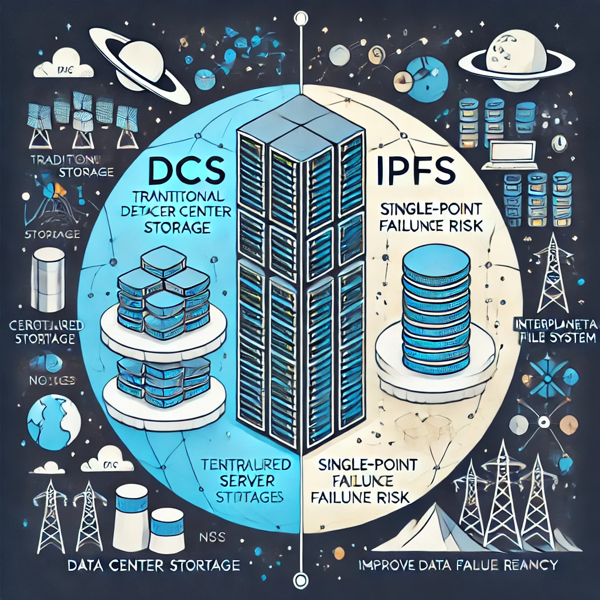

### 立项依据：

之前2024年OSH课上的`ArkFS`实现了`AI`处理用户输入以实现对存储文件的简单操作，而`vivo50`组实现了分布式系统的分布式处理中央服务器并实现反向代理，而现在我们发现`ipfs/filecoin`的分布式存储本身就具有类似的能力，故而我们想实现基于`ipfs/filecoin`的分布式存储的人工智能实现智能处理用户命令。

## `IPFS\filecoin`文件储存系统：

### **一、核心优势**

#### **1. 去中心化与抗审查**

- **无单点故障**：文件分散存储在全球节点中，无需依赖中心化服务器。
- **抗 censorship**：内容通过哈希（CID）寻址，无法通过封锁URL删除数据（只要至少一个节点存储）。

#### **2. 内容寻址（CID）**

- **唯一性**：文件内容通过加密哈希生成CID，内容修改则CID必变，确保数据完整性。
- **去重存储**：相同内容仅存储一次（如多个用户保存同一文件，仅占用一份空间）。

#### **3. 经济激励（Filecoin）**

- **存储市场**：用户支付FIL代币，矿工通过竞争提供存储服务，通过智能合约保证可靠性。
- **证明机制**：矿工需提交复制证明（PoRep）和时空证明（PoSt），验证数据持续存储。

#### **4. 高性能与低成本**

- **P2P传输**：从最近的节点获取数据，降低延迟（如BitTorrent协议）。
- **长期存储**：Filecoin的价格通常低于传统云存储（尤其冷数据）。

#### **5. 数据主权与隐私**

- **用户控制密钥**：文件可端到端加密，仅持有密钥者能访问内容。

- **无厂商锁定**：数据可随时迁移到其他节点或网络。

  但是相应的带来了大量的缺点。

  | **缺点**         | **本质原因**        | **解决方案**                 |
  | :--------------- | :------------------ | :--------------------------- |
  | 存储冗余         | 内容寻址的不可变性  | 差异化存储、复用未修改块     |
  | 版本管理复杂     | 无内置版本控制系统  | IPNS+元数据表、类Git工具     |
  | Filecoin成本叠加 | 新旧CID独立存储订单 | 自动订单转移、冷热分离       |
  | 检索需知最新CID  | 无原生“最新”概念    | 通过IPNS或中间层代理维护指针 |

  这里其去中心化的特点比之前`vivo50`组实现的分布式处理中央服务器能力还要更加强大，它中的节点能竞争式的获取数据，从而实现用户以最优的策略实现存这也就意味着，当我们以该协议为基础建立分布式系统时，本身就是从去中心化开始的。另一方面，虽然CID与内容的强关联性使得避免了冲突的发生，提高了系统的稳定性，但是这也意味着我们修改一个文件变得更加困难，以及产生大量的节点消耗。

  下面是一张图片，体现传统的分布式文件系统和IPFS的区别：
  
  
  
  同时由于CID与内容的强关联性，也就是说哪怕只修改一个bit数据，CID可能会有极大变化，也就意味着我们很难在源文件上存储时删除，修改文件。
  
  事实上，我们打算建立一个基于`ipfs`协议的拥有智能处理用户部分输入，以及能够为用户输入文件智能打标，同时对打标进行存储的的中间代理。
  
  基于`OSH-2024ARKFS`组的已有工作，我们认为大模型的人工智能打标效果，处理自然语言文件的效果要好于传统人工智能，我们将延续他们使用的方法对于文件智能打标。
  
  我们的初步计划是将该中间端口链接到某个有效的大模型人工智能系统，从而实现智能打标。
  
  以下是大模型的一些优势：
  
  ### **1. 泛化能力极强**
  
  - **传统AI**：依赖特定任务的数据和特征工程，换任务需重新训练（如图像分类模型无法处理文本）。
  - **大模型**：
    - 通过海量数据和参数（千亿级），学习通用表征，可处理跨模态任务（文本、图像、音频等）。
    - **示例**：GPT-4既能写代码，又能分析医学影像报告。
  
  ------
  
  ### **2. 少样本/零样本学习**
  
  - **传统AI**：需大量标注数据（如训练垃圾邮件分类器需数万条标记邮件）。
  - **大模型**：
    - 通过预训练吸收通用知识，仅需少量示例（Few-shot）甚至无需示例（Zero-shot）即可完成任务。
    - **示例**：向ChatGPT展示2-3个翻译样例，它就能模仿翻译新语种。
  
  ------
  
  ### **3. 多任务统一处理**
  
  - **传统AI**：每个任务需独立模型（如情感分析、命名实体识别需不同NLP模型）。
  - **大模型**：
    - 单一模型通过提示词（Prompt）切换任务，无需重新训练。
    - **示例**：同一模型可回答问题、生成摘要、编写诗歌，仅需调整输入指令。
  
  ------
  
  ### **4. 上下文理解与连贯生成**
  
  - **传统AI**：序列生成易出现逻辑断裂（如早期聊天机器人答非所问）。
  - **大模型**：
    - 基于注意力机制（如Transformer），捕捉长距离依赖，生成连贯、符合语境的文本。
    - **示例**：GPT-4能续写小说并保持角色性格一致性。
  
  ------
  
  ### **5. 跨模态融合能力**
  
  - **传统AI**：模态间需复杂对齐（如视频描述需单独训练视觉-语言模型）。
  - **大模型**：
    - 原生支持多模态输入/输出（文本+图像+音频）。
    - **示例**：Google的PaLM-E可结合图像和文本指令控制机器人。
  
  ------
  
  ### **6. 自动化特征工程**
  
  - **传统AI**：依赖人工设计特征（如SIFT特征用于图像识别）。
  - **大模型**：
    - 自动从原始数据中提取高层次特征，减少人工干预。
    - **示例**：CLIP模型直接学习图像-文本关联，无需手动标注特征。
  
  ------
  
  ### **7. 持续学习潜力**
  
  - **传统AI**：模型部署后难更新，易过时。
  - **大模型**：
    - 通过微调（Fine-tuning）或提示工程快速适应新领域。
    - **示例**：金融领域大模型可通过注入最新财报数据更新知识。
  
  ------
  
  ### **8. 人机交互友好性**
  
  - **传统AI**：需结构化输入（如填写表单字段）。
  
  - **大模型**：
  
    - 支持自然语言交互，降低使用门槛。
  
    - **示例**：用户用口语描述需求（“帮我写封投诉信”），模型直接生成结果。
  
      下面是一个体现传统人工智能与大模型的区别：
  
      
  
      我们将简述利用一个图形我们如何如何搭建相应的模型，或者说我们如何对于先前已有的工作进行完善。
  
      ```mermaid
      %%{init: {'theme': 'base', 'themeVariables': { 'primaryColor': '#ffdfd3', 'edgeLabelBackground':'#fff'}}}%%
      flowchart TD
          A[用户] -->|上传文件| B(正向代理)
          B -->|鉴权/加密| C{权限校验?}
          C -->|通过| D[AI打标服务]
          C -->|拒绝| A
          D -->|调用大模型| E[(大模型API)]
          E -->|返回标签| D
          D -->|存储标签索引| F[(CID-标签数据库)]
          D -->|路由到IPFS节点| G[反向代理]
          G -->|负载均衡| H[IPFS节点集群]
          H -->|分块存储| I[(IPFS网络)]
          H -->|返回根CID| G
          G -->|同步CID| D
          D -->|返回CID+标签| B
          B -->|日志记录| J[(日志系统)]
          B -->|响应用户| A
      
          subgraph 用户端
              A
          end
      
          subgraph 代理层
              B -->|正向代理| D
              D -->|AI打标服务| G
          end
      
          subgraph AI服务层
              D --> E
          end
      
          subgraph 存储层
              H --> I
              F
          end
      
          style A fill:#f9d5e5,stroke:#333
          style B fill:#e3eaa7,stroke:#333
          style D fill:#ffb347,stroke:#333
          style G fill:#b2d3c2,stroke:#333
          style H fill:#86af49,stroke:#333
          style I fill:#b2d3c2,stroke:#333,stroke-dasharray: 5
          style E fill:#ff8a65,stroke:#333
          style F fill:#82b4d6,stroke:#333
          style J fill:#f9d5e5,stroke:#333
      ```

这里我将讲述我们的优势：我们相比于之前的组，设置了正向代理，该代理能够保护我们的`AI`服务层，同时使得我们的数据更加的安全。同时，引入了`IPFS`协议从而实现更加完善的去中心化。

同时，我们增添了自然语言处理服务，我们旨在实现对于用户的一些相对简单的命令进行智能的处理，对于文件进行一些智能的打标，从而可以更好地实现对于用户的需求。

同时我们的分布式文件系统是建立在IPFS协议栈上的，我们也很有可能对于之前组的一些现有的工作进行继承，例如网页的前端，处理器与存储器的去中心化的处理，对于文件资源的监控等等。

### 1. **正向代理 (Forward Proxy)**

**定义**：正向代理是客户端（如浏览器）与服务器之间的一个中介。客户端请求网络资源时，先请求正向代理服务器，然后代理服务器再代表客户端去访问目标服务器，获取数据返回给客户端。

**常见用途**：

- **隐藏真实IP**：通过正向代理，客户端的真实IP地址可以被隐藏，只有代理服务器的IP地址被目标服务器看到。
- **访问受限制资源**：例如，访问某些被墙的内容，正向代理可以帮助绕过访问限制。

**例子**：

- **企业/学校的网络代理**：公司或学校常常使用正向代理来限制员工或学生访问某些网站，或者监控浏览记录。比如，所有员工上网时，都会先通过公司设置的代理服务器，然后由代理服务器向外界请求网页。

### 2. **反向代理 (Reverse Proxy)**

**定义**：反向代理与正向代理相反，代理服务器不代表客户端，而是代表服务器接受外部的请求。客户端对外请求的内容是通过反向代理服务器转发到内部服务器的，外部客户端并不直接访问目标服务器。

**常见用途**：

- **负载均衡**：反向代理可以将请求分配到多台服务器，从而实现负载均衡，提高服务器的处理能力。
- **增强安全性**：反向代理服务器可以隐藏内部服务器的真实IP和细节，增强安全性。
- **缓存加速**：反向代理可以缓存常见的请求，减轻后端服务器的压力，提高响应速度。

**例子**：

- **网站的反向代理**：例如，大型网站（如淘宝、Google等）使用反向代理来管理数百台服务器。用户请求的所有内容首先到达反向代理，代理服务器决定将请求转发到哪台实际的服务器上处理。

### 3. **中间代理 (Middleware Proxy)**

- **定义**：服务层是应用程序的核心层之一，它用于将业务逻辑与数据访问层分开，处理一些特定的应用逻辑和服务协调。它通常与数据库和其他后端服务交互，作为用户与后端系统之间的一个抽象。

**例子**：

- 在微服务架构中，服务层可以负责协调多个微服务之间的交互，提供一组统一的接口供客户端访问，而不需要直接与每个微服务进行交互。

  下面是一张体现服务层架构的图片：

  

可以看到，服务层是可以有很多层的，我们的任务之一就是在我们的玩具式分布式系统上加入一层服务层。
